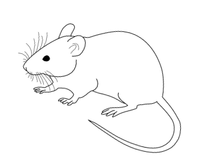

# The Controversial Rodent Dissection

**Teacher:** [<u>Felipe Monroy,</u>](mailto:fmonroy@uplifteducation.org) Uplift Williams Preparatory, Dallas, Texas

**Research Host:** Samuel Achifelu, PhD - Chair, PI & Hosting Lab, Kenneth S. Hettie, PhD - Instructor, Hosting Faculty, and Mentor, University of Texas at Southwestern - Biomedical Engineering Department

## Table of Contents

[<u>Teacher Notes 4</u>](#teacher-notes)

> [<u>Purpose 4</u>](#purpose)
>
> [<u>Background Knowledge 4</u>](#background-knowledge)
>
> [<u>Homologous and Analogous Structures 4</u>](#homologous-and-analogous-structures)

[<u>Materials 6</u>](#materials)

[<u>Learning Standards 7</u>](#learning-standards)

[<u>Learning Connections 8</u>](#learning-connections)

> [<u>Prerequisite Skills: 8</u>](#prerequisite-skills)
>
> [<u>International Baccalaureate (IB) - Middle Years Programme (MYP): 8</u>](#international-baccalaureate-ib---middle-years-programme-myp)
>
> [<u>Anatomy and Physiology: 8</u>](#anatomy-and-physiology)
>
> [<u>Biology: 9</u>](#biology)
>
> [<u>Middle School Sciences: 9</u>](#middle-school-sciences)

[<u>Safety Guidelines 10</u>](#safety-guidelines)

> [<u>Dissection Lab Safety Rules 10</u>](#dissection-lab-safety-rules)
>
> [<u>Dissection Tools and Functions 11</u>](#dissection-tools-and-functions)
>
> [<u>Safety Quiz 15</u>](#safety-quiz)
>
> [<u>Answers Key 15</u>](#answers-key)

[<u>Comfort Survey: The Dissection of a Laboratory Rat 17</u>](#comfort-survey-the-dissection-of-a-laboratory-rat)

[<u>Ethics: Animal Dissection - A Contested School Science Activity 21</u>](#ethics-animal-dissection---a-contested-school-science-activity)

> [<u>Introduction: What is the purpose of animals being used in research? 21</u>](#introduction-what-is-the-purpose-of-animals-being-used-in-research)
>
> [<u>Ancillary Text 1: Animal Dissection: A Contested School Science Activity 23</u>](#ancillary-text-1-animal-dissection-a-contested-school-science-activity)
>
> [<u>Ancillary Text 2: Under the knife - The Benefits of Animal Dissection 25</u>](#ancillary-text-2-under-the-knife---the-benefits-of-animal-dissection)
>
> [<u>Ancillary Text 3: Ethics of Animal Use in Research 27</u>](#ancillary-text-3-ethics-of-animal-use-in-research)

[<u>Rodent Dissection Manual 31</u>](#rodent-dissection-manual)

> [<u>Pre-Lab Activity 31</u>](#pre-lab-activity)
>
> [<u>Lab Activity (adapted from Rat Dissection Student Version) 32</u>](#lab-activity-adapted-from-rat-dissection-student-version)
>
> [<u>Part One: External Anatomy 32</u>](#part-one-external-anatomy)
>
> [<u>Part Two: Opening the Rat 33</u>](#part-two-opening-the-rat)
>
> [<u>Part Three: Digestive System 34</u>](#part-three-digestive-system)
>
> [<u>Part Four: Respiratory System 35</u>](#part-four-respiratory-system)
>
> [<u>Part Five: Circulatory System 37</u>](#part-five-circulatory-system)
>
> [<u>Part Six: Urogenital System 39</u>](#part-six-urogenital-system)
>
> [<u>Part Seven: Nervous System 40</u>](#part-seven-nervous-system)
>
> [<u>Part Eight: Clean-up 42</u>](#part-eight-clean-up)
>
> [<u>Part Nine: Final Notes 43</u>](#part-nine-final-notes)
>
> [<u>Common Checks for Understanding (CFUs) 44</u>](#common-checks-for-understanding-cfus)
>
> [<u>General CFUs 44</u>](#general-cfus)
>
> [<u>Structures of the Head and Neck 44</u>](#structures-of-the-head-and-neck)
>
> [<u>The Abdominal Organs 44</u>](#the-abdominal-organs)
>
> [<u>The Reproductive Organ 44</u>](#the-reproductive-organ)
>
> [<u>Post-lab Activities 46</u>](#post-lab-activities)
>
> [<u>Part One: Check for Understanding 46</u>](#part-one-check-for-understanding)
>
> [<u>Part Two: Lab Report 46</u>](#part-two-lab-report)
>
> [<u>Part Three: Reflection 48</u>](#part-three-reflection)
>
> [<u>The Advantages of Actual Frog Dissection 49</u>](#the-advantages-of-actual-frog-dissection)
>
> [<u>Animals Used in Education Classroom Dissection 51</u>](#animals-used-in-education-classroom-dissection)
>
> [<u>Writing Options for Students 54</u>](#writing-options-for-students)

[<u>Social Impact 55</u>](#social-impact)

[<u>Mathematics Extension 57</u>](#mathematics-extension)

[<u>Interdisciplinary Approach 59</u>](#interdisciplinary-approach)

[<u>Further Directions 60</u>](#further-directions)

[<u>References 61</u>](#references)

## Teacher Notes

### 

### Purpose

In this lab, students will be examining many characteristics of a rat’s anatomy and physiology. They will compare and contrast the advantages and disadvantages of using animal models –a prepared specimen for dissection versus an alternative non-living –plastic model, and compare and contrast the homology that rats have to humans. This action plan can be implemented in sections: you can implement just the [<u>dissection component</u>](#rodent-dissection-manual), the [<u>supporting activities</u>](#interdisciplinary-approach) in isolation, or you can implement it in its entirety.

### Background Knowledge

After its domestication over a century ago, the laboratory rat has been the preferred animal model in the biomedical research field. The “physiology \[of the Rattus norvegicus domestica\], size, and genetics, reproductive cycle, cognitive and behavioral characteristics have made it a particularly useful \[animal\] for studying many human disorders and diseases” (Meek S, Mashimo T, Burdon T., 2017). For example, through selective breeding, largely through advances in genetic engineering technologies such as [<u>CRISPR</u>](#further-directions), scientists can research common diseases affecting people's quality of life –hypertension, obesity, and neurobiology disorders.

Advances in “genetic engineering have brought the laboratory rat to the forefront of biomedical studies and enabled researchers to exploit the increasingly accessible wealth of genome sequence information” that this model could provide to eradicate diseases Meek S, Mashimo T, Burdon T. In this classroom activity, teachers should examine with their students the “importance of animal models in relevant topics concerning current human and animal health\[, and\] how different animal species have been used to study pandemics, such as the 2019 Coronavirus…, and \[how\] oncological disorders are being understood while developing new therapeutic approaches” (Domínguez-Oliva A, Hernández-Ávalos I, Martínez-Burnes J, Olmos-Hernández A, Verduzco-Mendoza A, Mota-Rojas D., 2023).

Finally, as you introduce this lesson to your young biologists and biomedical researchers, teachers should consider discussing the controversy of using animal models and the ethical challenges that researchers face in medicine. “Animal models are essential for understanding physiopathology and novel treatment alternatives for several animal and human diseases\[; therefore,\] studying the process in different animal species before testing.. On humans” is critical (Domínguez-Oliva A, Hernández-Ávalos I, Martínez-Burnes J, Olmos-Hernández A, Verduzco-Mendoza A, Mota-Rojas D., 2023).

### 

### Homologous and Analogous Structures

A dissection activity is a very effective method to observe and study comparative anatomy. While examining the external anatomy and the dissection and study of the internal anatomy, look for “homologous structures” and “analogous structures.”

Homologous structures are structures that are similar in different species that descended from a common ancestor. These structures do not necessarily perform the same function. Consider the forelimbs of 3 very different mammals. The forelimbs of the cat, bat, and whale all have similar bone structures, but the forelimbs perform very different functions.

Alternatively, structures of organisms that are similar, but evolved distinctly in different ancestors, are called analogous structures. These structures are similar because of the environment. For example, a bat's wing is very similar to a bird's wing, but each wing evolved in a different ancestor to suit the adaptation of flight.

A basic comparative animal anatomy study can be carried out through the dissection of a rat, shark, frog, and pig. Compare the limbs, integument, sensory organs and structures, and organ systems. Notice the features that all organisms share that identify them as belonging to Kingdom Animalia; bilateral symmetry, a vertebral column, and a cranium are readily apparent. Notice that the lungs of the frog are proportionally smaller than those of the rat and pig. The shark lacks lungs entirely and has gills. What are the differences in the environment that might account for this? Comparative anatomy—a study of questioning and discovering similarities and differences—naturally lends itself to inquiry-based learning.

## 

## 

## 

## 

## 

[<u>Back to TOC.</u>](#table-of-contents)

## Materials

Dissections help researchers to get a three-dimensional view of how the systems of a body work together. In this activity, students will observe how the respiratory, digestive, circulatory, urogenital, and nervous systems are arranged spatially. They will also have the opportunity to understand how systems function independently and synchronously with one another. The initial investment for the following materials depends on your class size. You might want to consider pairing students in groups of three according to specific roles; therefore, you will need 10-15 items of each set of materials for a class of 30-45.

**Non-consumable items:**

1.  [<u>Student Dissecting Set</u>](https://www.carolina.com/dissecting-sets/student-dissecting-set-i/621096.pr?question=dissection+kit)

2.  [<u>Dissecting Pan, Aluminum, with Vinyl Dissecting Pad</u>](https://www.carolina.com/dissecting-pans-pads/dissecting-pan-aluminum-with-vinyl-dissecting-pad/629004.pr?question=dissection+tray)

3.  [<u>Large Animal Dissection Tray, 16 x 30", with Pad</u>](https://www.carolina.com/dissecting-pans-pads/large-animal-dissection-tray-16-x-30-with-pad/629068.pr?question=dissection+tray) (to conduct the activity over several days, the specimen will need to be stored in the larger tray so other class periods can use the smaller pan)

4.  [<u>Large Animal Dissection Tray Cover</u>](https://www.carolina.com/dissecting-pans-pads/large-animal-dissection-tray-cover/629069.pr?question=dissection+tray)

5.  [<u>Altay Male and Female Rat</u>](https://www.carolina.com/animal-models-skeletons/altay-male-and-female-rat/565240.pr?question=altay)

6.  [<u>Cleared and Stained Rat, 4 to 5"</u>](https://www.carolina.com/preserved-rats-and-mice/cleared-and-stained-rat-4-to-5/228680.pr?question=rat)

7.  [<u>Carolina® Dissection Flip Charts</u>](https://www.carolina.com/preserved-organisms-classroom-resources/carolina-frog-dissection-flip-chart/229975.pr)

8.  [<u>Transparent Plastic Laboratory Apron</u>](https://www.carolina.com/lab-aprons-lab-coats/clearlite-plastic-laboratory-apron/FAM_706260.pr)

9.  [<u>Dissecting Pins, Nickel-Plated, 2"</u>](https://www.carolina.com/dissecting-probes-pins/dissecting-pins-nickel-plated-2-in-bx-900/629122.pr?question=dissecting+pins)

10. [<u>Safety Goggles</u>](https://www.carolina.com/lab-eye-protection/safety-goggles-value-pack-small-pink/646703C.pr)

**Consumable items:**

1.  [<u>Carolina's Perfect Solution® Preserved Rats, 7"+</u>](https://www.carolina.com/preserved-rats-and-mice/carolinas-perfect-solution-rat-7-plain-pail/228304.pr?question=rat)

    1.  Carolina’s specimens do not constitute hazardous waste under federal or Texas regulations. They also are not biohazards. There should be no reason to treat them as anything other than normal waste. You might take the specimens, double bag them, and send them out with the regular trash.

    2.  If you have fluid in pails, you should be able to send it into the sanitary sewer with an excess of water. You might slowly pour the fluid down a sink that drains to the sanitary sewer with slowly running water, then follow with an excess of water.

2.  [<u>Carolina's Wetting Solution</u>](https://www.carolina.com/dissection-fluids/carolinas-wetting-solution-16-oz/220120A.pr?question=with+Carolina%C3%A2%C2%80%C2%99s+Wetting+Solution)

3.  [<u>Latex Free Medical Gloves</u>](https://www.amazon.com/Inspire-Grade-Powder-Stretch-Gloves/dp/B00WBNYA28/ref=sr_1_1_sspa?crid=300HRMSRZUAMP&keywords=gloves&qid=1686593335&sprefix=gloves%2Caps%2C104&sr=8-1-spons&psc=1&spLa=ZW5jcnlwdGVkUXVhbGlmaWVyPUFHNkFYTFZRUlBJM04mZW5jcnlwdGVkSWQ9QTAxMDk5NTMxWkJJMzYyTTg0WUpDJmVuY3J5cHRlZEFkSWQ9QTA5MTMzNjUzRTgwUzM5M0dRREdOJndpZGdldE5hbWU9c3BfYXRmJmFjdGlvbj1jbGlja1JlZGlyZWN0JmRvTm90TG9nQ2xpY2s9dHJ1ZQ==) (every class period, students will need to use a new set of gloves)

4.  [<u>Face Mask Disposable</u>](https://www.amazon.com/HDFK-Disposable-Protective-Breathable-Non-Woven/dp/B088YJCQ7Z/ref=sr_1_2_sspa?keywords=face+mask&qid=1686593413&sprefix=face%2Caps%2C111&sr=8-2-spons&psc=1&spLa=ZW5jcnlwdGVkUXVhbGlmaWVyPUEyM0VSR0RGS1BPRU1YJmVuY3J5cHRlZElkPUEwNzgwNDc4MjJEVjBCS0NNVktRMSZlbmNyeXB0ZWRBZElkPUEwNTQxMDY5MUhBSEFRUUpIU0U0UyZ3aWRnZXROYW1lPXNwX2F0ZiZhY3Rpb249Y2xpY2tSZWRpcmVjdCZkb05vdExvZ0NsaWNrPXRydWU=) (one per student per class)

5.  [<u>Disinfectant Wipes</u>](https://www.amazon.com/Lysol-Disinfectant-Multi-Surface-Antibacterial-Disinfecting/dp/B0BNNVT2VH/ref=sr_1_1_sspa?crid=2QLS9P27NTWMW&keywords=disinfecting+wipes&qid=1686593472&sprefix=disin%2Caps%2C106&sr=8-1-spons&psc=1&spLa=ZW5jcnlwdGVkUXVhbGlmaWVyPUExRUozWk1ERjRaRFVKJmVuY3J5cHRlZElkPUEwMTgwNjc5M0lESjdUUTBGNEtBNyZlbmNyeXB0ZWRBZElkPUEwNDU0OTMyMldJUFFPNkhGVDEzMCZ3aWRnZXROYW1lPXNwX2F0ZiZhY3Rpb249Y2xpY2tSZWRpcmVjdCZkb05vdExvZ0NsaWNrPXRydWU=) (to clean trays, table tops, and pans after using them)

6.  [<u>Alcohol Pads</u>](https://www.amazon.com/Dynarex-Alcohol-Prep-Sterile-Medium/dp/B005BFL0RQ/ref=sr_1_1_sspa?keywords=alcohol+prep+pads&qid=1686593556&sprefix=alc%2Caps%2C107&sr=8-1-spons&psc=1&smid=A3UACI1DKLHUO0&spLa=ZW5jcnlwdGVkUXVhbGlmaWVyPUExSlBUQzZLT0ZLQkw2JmVuY3J5cHRlZElkPUEwOTkzMTYyMzVQN0hDOTZUQzdXNCZlbmNyeXB0ZWRBZElkPUEwOTk2NzY0MTZQVkgyMFgzWkdXSiZ3aWRnZXROYW1lPXNwX2F0ZiZhY3Rpb249Y2xpY2tSZWRpcmVjdCZkb05vdExvZ0NsaWNrPXRydWU=) (to sanitize goggles)

**Rat Dissection Video:** [<u>Full Protocol</u>](https://drive.google.com/file/d/12km2hWPSAU5Yc8wWTI0KEYdj_dwBdXdA/view?usp=sharing), courtesy of [<u>Mr. Exham YouTube channel</u>](https://www.youtube.com/user/mrexham).

> **Rat Dissection Videos:** [<u>Step-by-step protocol</u>](https://drive.google.com/drive/folders/1ffXl_5kZF2P4rB8TCsNpqosGXSSZ6-Rp?usp=sharing) on how to dissect a rat, courtesy of [<u>Gianna Maggiore</u>](mailto:gianna.maggiore@utsouthwestern.edu), UT Southwestern graduate student.

[<u>Back to TOC.</u>](#table-of-contents)

## Learning Standards 

## 

## 

**Texas Essentials of Knowledge & Skills**

Middle School Sciences:

- 7.12(B) Identify the main functions of the systems of the human organism, including the circulatory, respiratory, skeletal, muscular, digestive, excretory, reproductive, integumentary, nervous, and endocrine systems.

- 7.12(C) Recognize levels of organization in plants and animals, including cells, tissues, organs, organ systems, and organisms.

High School Readiness:

- Biology: B.2(F) Collect and organize qualitative and quantitative data and make measurements with accuracy and precision using tools such as data‐collecting probes, standard laboratory glassware, microscopes, various prepared slides, stereoscopes, metric rulers, balances, gel electrophoresis apparatuses, micropipettes, hand lenses, Celsius thermometers, hot plates, lab notebooks or journals, timing devices, Petri dishes, lab incubators, dissection equipment, meter sticks, and models, diagrams, or samples of biological specimens or structures.

**Advanced Placement and International Baccalaureate**

AP Biology Connections:

- BIG IDEA 4 - SYSTEMS INTERACTIONS (SYI): Biological systems interact, and these systems and their interactions exhibit complex properties. All biological systems comprise parts that interact with one another. These interactions result in characteristics and emergent properties not found in the individual parts alone. All biological systems from the molecular level to the ecosystem level exhibit properties of biocomplexity and diversity. These two properties provide robustness to biological systems, enabling greater resiliency and flexibility to tolerate and respond to changes in the environment.

IB/DP Connections:

- Topic: Animal Physiology.

[<u>Back to TOC.</u>](#table-of-contents)

## Learning Connections

### Prerequisite Skills:

- Recognize the goals, methods, and limitations of science.

- Ability to design an experiment, gather and interpret data, and draw conclusions based on that data.

- Recognize surface landmarks on the rat’s body.

- Identify, compare, and contrast the major macroscopic and microscopic structural tissues, systems, and organs of the rat’s body and relate each to function.

- Recognize and discuss the significance of the interdependence of organs and organ systems in the rat’s body.

- Utilize techniques of dissection on a preserved rat and relate results to other mammalian systems, including humans.

### International Baccalaureate (IB) - Middle Years Programme (MYP):

- Global Contexts:

  - Identities and Relationships

  - Global Exploration: Roles

- Key Concept:

  - Systems: sets of interacting or interdependent components. Systems provide structure and order in human, natural, and built environments.

- Related Concepts:

  - Function and Interaction

- Statement of Inquiry:

  - Systems create organization of the interactions and functions between humans and the natural world

    - Conceptual Understanding: Systems create organization of the interactions and functions in an environment.

### Anatomy and Physiology:

- In advanced Anatomy and Physiology courses, students conduct laboratory and field investigations, use scientific methods and tools during investigations, and make informed decisions using critical thinking and scientific problem-solving.

- Students in Anatomy and Physiology study a variety of topics, including the structure and function of the human body and the interaction of body systems for maintaining homeostasis.

- Students collect and organize qualitative and quantitative data and make measurements with accuracy and precision using tools such as dissection equipment, and models, diagrams, or samples of biological specimens or structures.

### 

### 

### 

### Biology:

- The student will demonstrate an understanding of the interactions and functions of systems in organisms.

- The student knows that biological systems are composed of multiple levels.

- The student is expected to:

  - Describe the interactions that occur among systems that perform the functions of regulation, nutrient absorption, reproduction, and defense from injury or illness in animals.

  - Analyze the levels of organization in biological systems and relate the levels to each other and to the whole system.

- The student knows that taxonomy is a branching classification based on the shared characteristics of organisms and can change as new discoveries are made.

  - The student is expected to:

  - Define taxonomy and recognize the importance of a standardized taxonomic system to the scientific community.

  - Categorize organisms using a hierarchical classification system based on similarities and differences shared among groups.

  - Compare characteristics of taxonomic groups, including archaea, bacteria, protists, fungi, plants, and animals (specifically).

### Middle School Sciences:

- The student is expected to recognize levels of organization in plants and animals, including cells, tissues, organs, organ systems, and organisms.

**Student Takeaways:**

Upon successful completion of this unit, students will be able to:

- Utilize techniques for handling and storing a preserved specimen (sharks and pigs will be dissected in their middle school years).

- Demonstrate and convey to others a respectful attitude at all times toward the specimen.

- Utilize techniques of dissection on a preserved rat while demonstrating appropriate techniques and use of instruments.

- Identify, compare, and contrast the major macroscopic organs, organ structures, and organ systems of the human body and relate each to function.

- Recognize and discuss the significance of the interdependence of organs and organ systems in the rat’s body to the human body.

- Identify and describe differences between actual human anatomy to a rat’s body and information contained in textbook illustrations.

[<u>Back to TOC.</u>](#table-of-contents)

## Safety Guidelines

To ensure a safe and engaging lab activity, students will be required to review the safety protocol and submit a quiz demonstrating their understanding of dissection safety before they will take part in any in-class dissections. Ensure that the following rules, protocols, and procedures are always visible when performing any dissections. The following section is divided into four components: safety rules, tools and functions, anatomical directional terms, and a safety quiz.

###  **Dissection Lab Safety Rules**

1.  Always read the lab procedures before beginning the activity.

2.  Do not engage in horseplay! Be mindful of your workspace and your behavior when working with sharp instruments.

3.  Identify an area where all the safety equipment is before beginning (first aid kit, eye wash station, etc.).

4.  Do not eat or drink in a lab where dissection is occurring. This includes chewing gum. The formaldehyde could contaminate gum and become poisonous.

5.  Do not lick or eat the specimen being dissected.

6.  Pin the specimen to be dissected securely in the dissecting pan or tray. Never dissect while holding the specimen in your hand(s).

7.  When applicable wear safety goggles, gloves, and a lab apron or gown.

8.  Remove contact lenses so chemicals cannot be trapped in your eyes underneath them.

9.  Point sharp objects or tools away from yourself and others.

10. Do not use excess force when working with a sharp instrument such as a scalpel as this can result in snapping the blade or damaging your specimen.

11. If you require a new blade due to breakage or dullness, please ask your teacher to demonstrate or change it for you.

12. Use dissecting scissors instead of a scalpel whenever possible. It tends to cut more

> efficiently for most work and is less dangerous to use.

13. Do not use any of the dissection equipment on your own body.

14. Make certain to return your dissection tools to their appropriate container. Care for and dispose of your specimen in accordance with the directions given by your teacher.

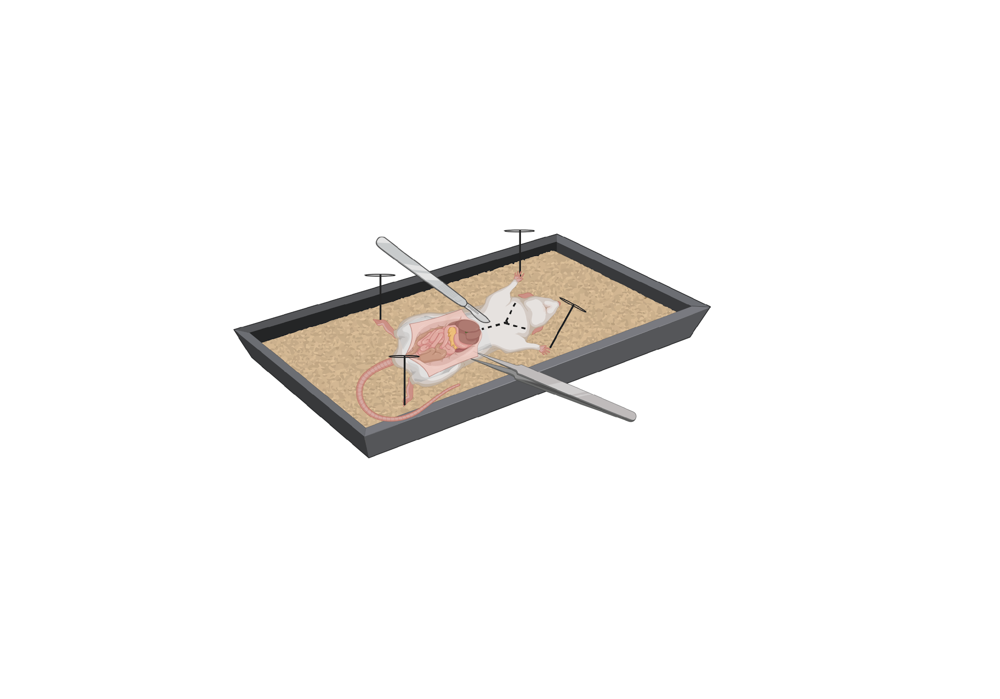

*Figure 1.0: Pinning the Specimen*

Created with BioRender.com.

### Dissection Tools and Functions

| **Name**                     | **Function**                                                             |
|------------------------------|--------------------------------------------------------------------------|
| Scalpel and disposable blade | Used for general cutting open of skin and tissue layers.                 |
| Surgical scissors            | Used for general cutting of skin. Also used for spreading tissue layers. |
| Anatomical Forceps           | Used for holding delicate structures.                                    |
| Curved Forceps               | Used to clean nerves and arteries through fat and *fascia*.              |
| Probe                        | Used to manipulate or to probe larger openings.                          |

Fascia - is a layer of fibrous connective tissue that surrounds muscles, groups of muscles, blood vessels, and nerves, binding some structures together, while permitting others to slide smoothly over each other.

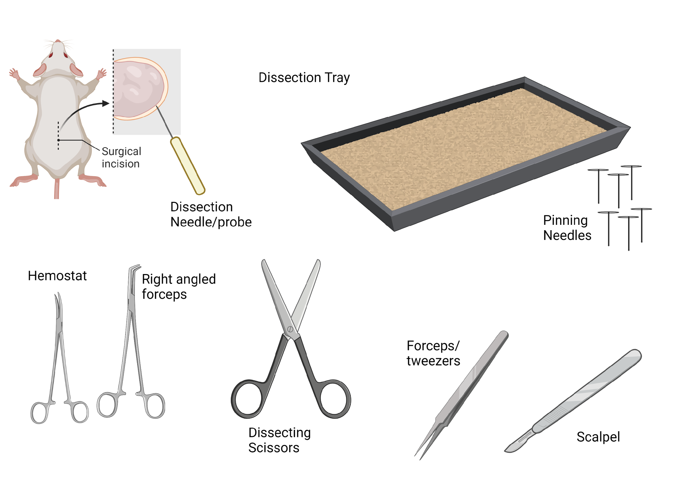

*Figure 2.0: Tools for Dissection*

Created with BioRender.com.

Ancillary video by Nasco Education: [<u>Basic Tools and Techniques for Safe Dissection in the Classroom</u>](https://drive.google.com/file/d/1a4u99s32UNhwkkbn7qHQGHYkj2QHHiHD/view?usp=sharing)

***Key Anatomical Directional Terms:***

1.  **Anterior:** Front 

2.  **Posterior:** Rear, behind

3.  **Distal:** Away from, farther from the origin

4.  **Proximal:** Near, closer to the origin 

5.  **Dorsal:** Near the upper surface, toward the back, top 

6.  **Ventral:** Toward the bottom, toward the belly 

7.  **Superior:** Above, over 

8.  **Inferior:** Below, under 

9.  **Lateral:** Toward the side, away from the midline

10. **Medial:** Toward the midline, middle

11. **Rostral:** Toward the front

12. **Caudal:** Toward the back, toward the tail

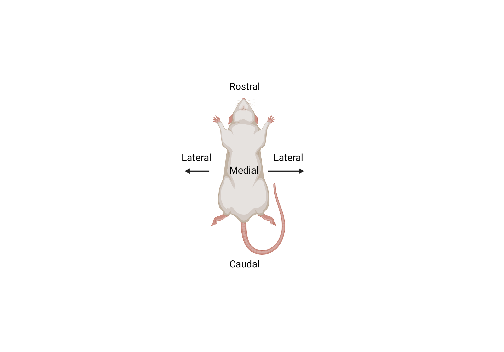

*Figure 3.1: Abdominal View of a Laboratory Rat*

Created with BioRender.com.

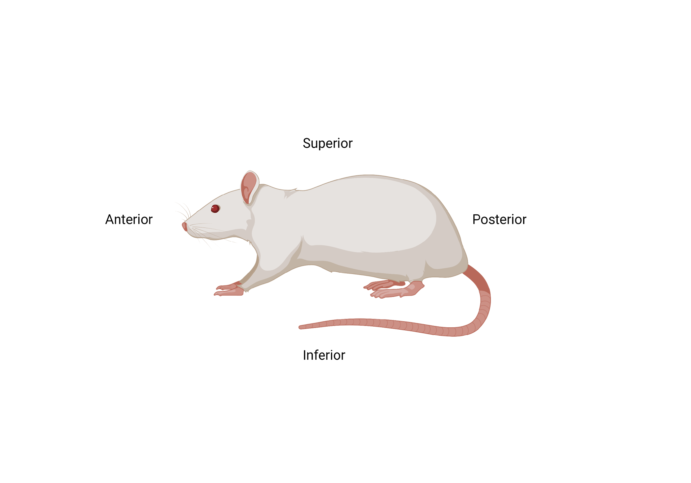

*Figure 3.2: Lateral View of a Laboratory Rat*

Created with BioRender.com.

### Safety Quiz

1.  What is the most important thing to do before starting a lab?

    1.  Put on goggles

    2.  Put on gloves

    3.  Pick up all your lab materials

    4.  Read through the entire lab

2.  Why is your answer above the most important step?

3.  Which of the following instruments is primarily used for cutting skin and connective tissues and should always be pointed away from yourself and other people?

    1.  Surgical Scissors

    2.  Scalpel

    3.  Anatomical Forceps

    4.  Curved Forceps

4.  What are two safety resources found in this science lab room?

5.  What safety equipment should you be wearing when participating in a dissection? (List all)

**<u>True or False</u>**

\_\_\_\_\_\_\_\_\_ 1. It is safe to eat and drink in the lab while performing a dissection.

\_\_\_\_\_\_\_\_\_ 2. You shouldn’t wear contacts when performing a dissection.

\_\_\_\_\_\_\_\_\_ 3. You should always try to use dissecting scissors instead of a scalpel if possible.

\_\_\_\_\_\_\_\_\_ 4. You should dissect your specimen while holding it in your hands.

\_\_\_\_\_\_\_\_\_ 5. If you break a scalpel blade you should try to change it yourself.

\_\_\_\_\_\_\_\_\_ 6. Using a scalpel requires you to be forceful to cut through multiple layers of tissue.

\_\_\_\_\_\_\_\_\_ 7. A probe should be used to look into your lab partner’s nose and mouth.

### Answers Key

1.  What is the most important thing to do before starting a lab?

    1.  Put on goggles

    2.  Put on gloves

    3.  Pick up all your lab materials

    4.  **Read through the entire lab**

2.  Why is your answer above the most important step?

> ***To ensure you know all the necessary steps to the lab before proceeding. You need to be aware of the safety precautions and the order you need to follow to complete the lab successfully.***

3.  Which of the following instruments is used for cutting skin and tissues and should always be pointed away from yourself and other people?

    1.  Surgical Scissors

    2.  **Scalpel**

    3.  Anatomical Forceps

    4.  Curved Forceps

4.  What are two safety features found in this science lab room?

- **First aid kit**

- **Eye wash station**

5.  What safety equipment should you be wearing when participating in a dissection?

- **Gloves**

- **Goggles**

- **Lab coat / apron**

**<u>True or False</u>**

FALSE 1. It is safe to eat and drink in the lab while performing a dissection.

TRUE 2. You shouldn’t wear contacts when performing a dissection.

> TRUE 3. You should always try to use dissecting scissors instead of a scalpel if possible.

FALSE 4. You should dissect your specimen while holding it in your hands.

FALSE 5. If you break a scalpel blade you should try to change it yourself.

> FALSE 6. Using a scalpel requires you to be forceful to cut through multiple layers of tissue.

FALSE 7. A probe can be used to look into your lab partner’s nose and mouth.

[<u>Back to TOC.</u>](#table-of-contents)

## **Comfort Survey: The Dissection of a Laboratory Rat**

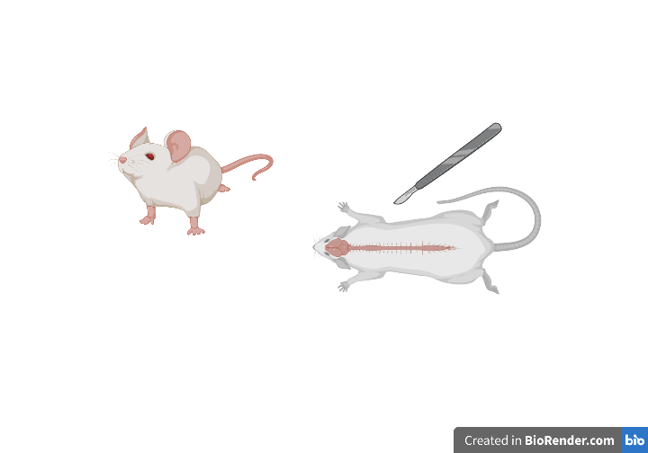
*Figure 4.0: Dissection of a Rat*

Created with BioRender.com.

**Vocabulary**

Have students create index cards for the following terms and add them to their study guides. They can use [<u>Frayer Models</u>](https://dpi.wi.gov/sites/default/files/imce/ela/bank/6-12_L.VAU_Frayer_Model.pdf) to conceptualize the meaning of each term.

- **Dissection:** the act of cutting up a dead person, animal, or plant in order to study it.

- **Morphology:** the form and structure of animals and plants, studied as a science.

- **Dexterity:** the skill of using your hands or your mind

- **Multisensory:** a way of teaching and learning that engages more than one sense at a time. Using sight, hearing, movement, and touch gives kids more than one way to connect with what they are learning.

- **Salient:** the most important information.

**Purpose**

- It is dissection alone which **allows us to recognize and relate body structure in three dimensions**. Dissection is a complex procedure to learn morphology which requires all of the senses. The exercise of dissection provides the feel for the fabric of the body and it improves our manual dexterity.

**Materials**

1.  Chromebook

2.  Multiple sheets of college-ruled paper with a proper heading (name, date, class period, lab number, and creative title)

3.  Index Cards

**Sources**

- Courtesy [<u>Middle School Science Blog</u>](https://middleschoolscience.com/tag/dissection/)

- BioRender - Rat Dissection graphics

- Oxford Learner’s Dictionary

**Background Information**

Dissection is a unique multisensory educational experience and is essential to learning the anatomical construction of the human and animal bodies. Also, dissecting tools will be used to open the body cavity of the rat and observe the structures. Keep in mind that dissecting does not mean "to cut up"; in fact, it means, "to expose to view".

Careful dissecting techniques will be needed to observe all the structures and their connections to other structures. You will not need to use a scalpel. Contrary to popular belief, a scalpel is not the best tool for dissection. Scissors serve better because the point of the scissors can be pointed upwards to prevent damaging organs underneath. Always raise structures to be cut with your forceps before cutting, so that you can see exactly what is underneath and where the incision should be made. Never cut more than is necessary to expose a part.

**Procedure**

1.  Read the Middle School Science Blog. You will access the website via Chromebook computers (you can create a TinyUrl to facilitate students accessing the website at a faster rate).

2.  Take notes using a [<u>two-column style system</u>](https://www.nbss.ie/sites/default/files/publications/two_column_notes.pdf). Summarize the information given on the blog.

3.  Choose a survey option in the section Student Survey Option Choices, and answer it in a short essay.

4.  Review the blog thoroughly.

5.  How to write an essay:

    1.  Start with your introduction. The introductory paragraph allows the reader to introduce the main idea of your essay, captures the interest of your readers, and tells why your topic is important. For this laboratory exercise, you will pick one of the survey option choices as your topic and elaborate on it based on the ideas and details captured from the blog.

    2.  Secondly, add a body paragraph. This section of your essay has a specific role and purpose within a paper, it fulfills the function of supporting the main idea, also known as thesis, of your essay –this is the option choice you made. The number of body paragraphs for a paper depends on the thesis and supporting evidence. There should be only one paragraph per the main idea.

        1.  Start your body paragraph with a claim, followed by a couple of sentences that explain how you plan to prove your point. This is also known as the evidence. Evidence is examples and they can be real-life examples, from textbooks, personal experiences, etc. Wrap up your body paragraph(s) by restating your claim in new words; validate why you chose your survey option.

    3.  Finalize your essay with a conclusion paragraph. A conclusion is an important part of the paper; it provides closure for the reader while reminding the reader of the contents and importance of the paper. You will accomplish this by stepping back from the specifics of the dissection in order to view the bigger picture of the document (why is it important to dissect, or not to dissect).

**Reflections and Important Information**

Before you start reading the blog and writing your position, please have your students consider the following information (these were the salient points from the blog).

- “Once we had the … prepared, and in the freezer, our next concern was student reaction.

- Would this be too much for them to handle?

- Would a lot of students opt out?

We discussed the sheep head dissection with our students and answered any, and all questions they had.

> **We expressed that they had options with how involved they wanted to be in the dissection process, that there were alternative options available, and we had them complete a quick Google survey.**
>
> We wanted their honest answers, and they were able to change their mind, either way once the dissections started.”

**Student Survey Options Choices**

You can create a Google survey to collect data and make an informed decision about how to prepare a particular class period for the activity.

1.  I am comfortable making observations, and handling the specimen and the dissecting tools

2.  I think I might be comfortable handling the specimen, and tools, and making observations

3.  I do not want to handle the specimen, but I would like to observe and take notes for my group

4.  I want to be in the room but keep my distance and get closer to the specimen as I get more comfortable

5.  I cannot be in the room for personal or religious reasons.

All students should be involved in some way based on their comfort level and the dissection so the dissection will be successful and a memorable experience for all learners.

[<u>Back to TOC.</u>](#table-of-contents)

## **Ethics: Animal Dissection - A Contested School Science Activity**

For this section, students will read and annotate three documents, according to the specified parameters that your campus dictates for language acquisition, about the use of animals for classroom activities, then take a stance on whether they are in favor or against this practice.

> **Annotation Example: *Using Sticky Notes.***

<table>
<colgroup>
<col style="width: 33%" />
<col style="width: 66%" />
</colgroup>
<thead>
<tr class="header">
<th><strong>Who</strong></th>
<th><strong>What</strong></th>
</tr>
<tr class="odd">
<th>Who is the text talking about?</th>
<th><ul>
<li><blockquote>

What is the text talking about?

</blockquote></li>
<li><blockquote>

What is it saying about the “who”?

</blockquote></li>
<li><blockquote>

What are some important features of the text?

</blockquote></li>
<li><blockquote>

What is the main idea of the paragraph/section?

</blockquote></li>
</ul></th>
</tr>
</thead>
<tbody>
</tbody>
</table>

### Introduction: What is the purpose of animals being used in research?

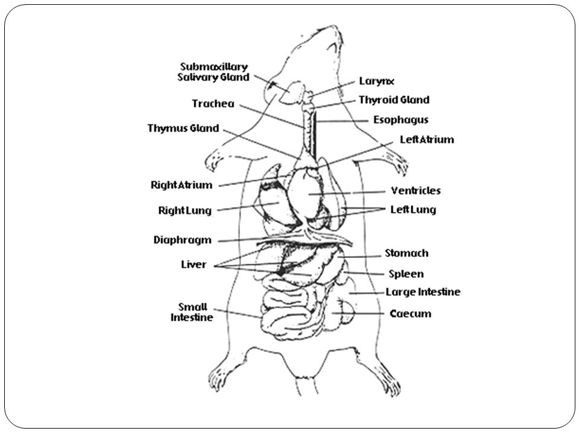

*Figure 5.0: Biological Drawing of a Rat*

Adapted from [<u>Investigation: Rat Dissection</u>](https://bio.libretexts.org/Learning_Objects/Worksheets/Book%3A_The_Biology_Corner_%28Worksheets%29/Anatomy_Worksheets/Investigation%3A_Rat_Dissection). (2019, June 2). Granite City School District.

Animals, from the fruit fly to the mouse, are widely used in scientific research. They are crucial for allowing scientists to learn more about human biology and health, and for developing new medicines.

The use of animals in scientific research has long been the subject of heated debate. On the one hand it is considered morally wrong to use animals in this way solely for human benefit.

On the other hand, removing animals completely from the lab would impede our understanding of health and disease, and consequently affect the development of new and vital treatments. Although sometimes these studies do reduce the quality of life of these animals, thorough regulations are in place to ensure that they are carried out in a humane way.

To help minimize the harm animals may experience while being studied in the laboratory, researchers are required to follow a set of principles, the ‘three Rs’. These are:

- **Replace:** Replacing, where possible, experiments using animals with alternative techniques such as cell culture, computer modeling, or human volunteers instead of animals.

- **Reduce**: Reduce the number of animals used, by improving experimental techniques and sharing information with other researchers so that the same experiments aren’t being done by many people.

- **Refine:** Refining the way the animals are cared for to help minimize any stress or pain, by using less invasive techniques where possible and improving medical care and living conditions.

**Note:** Keep in mind that dissecting does not mean "to cut up"; in fact, it means "to expose to view". You are a surgeon, not a butcher! Careful dissecting techniques will be needed to observe all the structures and their connections to other structures.

Below you can find guiding questions that scientists ask themselves as they are about to start dissection labs. Some of these questions you probably have asked yourself in the past, and some you may not have thought about.

1.  Are animal models useful?

2.  Do the positives associated with using animal models outweigh the negatives?

3.  Are animal experiments necessary?

4.  Is it morally correct to use animals in research?

5.  Should the use of animals in research be a mandatory part of modern progressive science?

*\*Note: Please have the students answer one of the previous questions in an essay format. They should use the writing techniques they have learned in language arts class. A suggested practice is to have students write in the [<u>Claim-Evidence-Reasoning-Rebuttal</u>](https://drive.google.com/file/d/1naiTYsloASeOEmEbLyNg0wbGxaNPkNeB/view?usp=sharing) format.*

#### Ancillary Text 1: Animal Dissection: A Contested School Science Activity

The Frog’s Case

Dissection is a common practice among middle and high school science classes. With new technology arising, there have been many debates that have been presented looking at the pros and cons of such behavior. Millions of animals are killed annually, there are little to no control measures in place, and animals suffer from the use of dissection among students. In the United States, six million frogs are dissected annually in high schools. An additional amount is used in elementary and universities across the world.

Jonathan Balcombe from the Humane Society of the United States researched the topic and found out that one US biological supply company sells more than 170 different species of preserved animals annually. There are few control measures in place currently protecting the rights of animals on how they are obtained to be sold for dissection. One inspection is required annually by the US Department of Agriculture to inspect the biological supply companies. The report of the inspections provides very little information about the facilities and how they are running.

The questions that arise from the reports are about cage construction and sanitation, leaving out the crucial questions about the animals themselves. This may be due to the fact most animals are already dead at the facility, and the United States Department of Agriculture (USDA) considers dead animals not their concern. In addition, the regulations that are set out for the US Animal Welfare Act do not include all animals. Amphibians, birds, fish, and reptiles caught and killed for dissection are not reported by the federal government. Finally, animals are taken from their natural habitats to be dissected.

Animals are living creatures that should be treated with the same respect as humans. Frogs are reported to be captured from their swamps, dogfish sharks are trapped in nets, and snakes, turtles, and others are caught wildly. Fetal pigs are removed from pregnant sows who are later slaughtered for their meat. However, information regarding the operations of biological supply companies is very hard to obtain due to secrecy. In 1971, there was the first study published by the science journal, BioScience which showed the collection of frogs for dissection.

The study investigated four major US biological supply companies. It displayed that frogs were kept in nylon mesh bags for a week for shipping, with a total of a hundred tightly packed into each. The frogs suffered severe temperatures and dryness; resulting in fifteen percent of frogs being dead after shipping. Half the frogs were said to be dead after sorting and holding in pens of 30,000 frogs during the winter after shipping. The authors concluded that “nearly every step of the catching and shipping places serve stress on the frog. It is said that behaviors have not changed since.

Video footage was released in 1990 by an undercover investigation run by Carolina Biological Supply Company, leaking many alarming images. Cats were being shoved into crowded gas chambers, crabs were being injected with deadly chemicals, and rats were struggling in facilities. In 1994, the World Society for the Protection of Animals (WSPA) investigated PARMEESA, a Mexican biological supply company. WSPA noted the drowning of thousands of cats, who were tied into cloth socks and put into the river.

All of the cats were then shipped to the US for dissection in classrooms. There are many cons to the use of animals for dissection; however, there are many pros as well. Dissections provide a clear understanding that visual students cannot provide, and it will give students a hands-on feel of what the future may be if they continue to study sciences. It is said that students remember things they can touch; therefore, they remember more in the future from the activity of dissecting.

A study of 400 random students was done, and the result was that 71% of students perceived the real dissection experience to be more useful than the virtual dissection. In addition, studies show that students retain 90% of what they physically perform and only 10% of what they see and hear. Grade five students at St. Frances Cabrini School dissected sharks, and students loved it. Two students, Oliver Perez Cruz and Daniel Moore said it was more fun than learning about sharks from their desks in the classroom.

The teacher Ms. Stickell said, “I can tell them about a heart and liver and gallbladder, but until they see it… it’s not real. I’m a visual person. ” Students who are studying biology to go into career paths can use the dissection as a learning factor. Studying the anatomy of the animal being dissected can be used to understand diseases, how organs and organ systems work together, and view the relative size of organs. I believe dissection should not be practiced.

Most of the students taking the biology course are forced to take it due to credits and are not heading in the career path regarding science; therefore, students who are learning the anatomy of animals will not be practicing it in the future. Animals should not be killed and endure suffering for the use of dissection if the same matters can be learned using a plastic figure or an online source. Due to respect for the animal, students should not be cutting them open after they have been captured. They are living creatures and should be treated like they are.

Source:

Essay Examples. (April 2021). Animal Dissection In Schools Essay. Retrieved from [<u>Animal Dissection in Schools Essay (Benjamin Barber)</u>](https://benjaminbarber.org/animal-dissection-in-schools-essay/)

[<u>Back to TOC.</u>](#table-of-contents)

#### Ancillary Text 2: Under the knife - The Benefits of Animal Dissection

Many teachers and education professionals maintain that there is no substitute for the hands-on learning experience of dissection. The learning that occurs courtesy of a dissection is vastly different from that afforded by a lecture or textbook lesson. Drawing together many of the topics students have heard and read about, dissection gives students first-hand experience in seeing the subject matter. This unique hands-on learning environment can impart an appreciation and understanding of anatomy unparalleled by second-hand teaching techniques.

Many individuals find it much easier to learn when they are able to carry out physical activities. Indeed, kinaesthetic learning, also known as hands-on experiences, does boast greater benefits for some, enabling them to engage more fully with the subject matter being studied. The hands-on approach of dissection allows students to see, touch and explore the various organs. Seeing organs and understanding how they work within a single animal may strengthen students’ comprehension of biological systems. When applied to their own bodies, this may then translate to a greater understanding of human biology.

While, of course, there are various differences between the intricacies, and specific details, of the human body and those of other animals, many of the internal systems can work in similar ways. From the location of organs to their interrelation with the surrounding tissue, the internal structure of a small animal can be likened to a simplified human body. Frogs and rats are often used in dissection when demonstrating the organ systems of a complex organism. The presence and position of the organs found in a frog and a laboratory rat are similar enough to a person to be able to provide insights into the internal workings of the human body.

More often than not, when students know they will be working on a real specimen, their attention is heightened. This can facilitate greater assimilation of information, enhanced understanding of the subject matter, and the ability to recall the biological science behind the specimen.

Similarly, many teachers believe the reality conveyed by dissection cannot be matched by alternatives. Virtual simulations cannot showcase abnormalities or variations from one specimen to the next. It would seem that overly perfect alternatives cannot compete with the biological surprises of real specimens and the learning opportunities they provide. From manipulating sharp instruments to employing delicate hand-eye coordination, the reality of physically dissecting a specimen can also develop fine motor skills.

From inspiring students’ career prospects to providing valuable hands-on practice, dissection can also prove to be a good early experience for those wishing to pursue pertinent professions. Early exposure to tools and techniques, as well as familiarity with organ tissue, may bolster some students’ ambitions. Indeed many surgeons may well credit their career to the fascination afforded by a classroom session with the scalpel.

Dissection is a memorable and instructive aspect of the biology curriculum, allowing students to learn how their own bodies work within the confines of the classroom. Computer software and dissection models provide additional resources to reinforce this practical hands-on approach.

Source:

The Importance of Dissection in Biology. (2016). Retrieved from [<u>The Importance of Dissection in Biology (EduLab)</u>](https://edulab.com/the-importance-of-dissection-in-biology/)

#### Ancillary Text 3: Ethics of Animal Use in Research

The use of animals in research, teaching, and testing is a controversial ethical and political issue. Much of the discussion about this issue revolves around the relative value, often referred to as 'moral value', of humans and animals. When the needs of animals and humans come into conflict, which takes precedence? Today there exists a wide spectrum of views on this subject, ranging from those concerned with animal 'rights' to those who view animals only as a resource to be exploited. All these viewpoints have contributed to the development of ethical principles of animal use. These in turn have shaped animal use regulations promulgated by the USDA and the Public Health Service, and reinforced by organizations such as the Association for Assessment and Accreditation of Laboratory Animal Care International (<u>[AAALAC](http://www.aaalac.org/))</u>, The American Association for Laboratory Animal Science (<u>[AALAS](http://www.aalas.org/))</u>, and the American Veterinary Medical Association (<u>[AVMA](https://www.avma.org/Pages/home.aspx))</u>.

Current legislation also recognizes that there are diverse viewpoints about the moral value of animals. Thus, all live animal use in research, teaching, or testing must be reviewed by a committee (the Institutional Animal Care and Use Committee, IACUC) with a diverse membership. This evaluation includes an emphasis on minimizing the overall use of animals.

Proposals for animal use are reviewed based on the potential for learning new information, or for teaching skills or concepts that cannot be obtained using an alternative. There are provisions for ensuring that animal use is performed in as humane a manner as possible, minimizing pain, distress, or discomfort. These provisions include a requirement for a veterinarian to be employed at each institution, so that the needs of the animals are looked after by someone trained in, and sympathetic toward animals' needs. It is also required that all personnel with animal contact be trained in appropriate handling techniques and that they be skilled in any experimental procedures that will be performed. Finally, basic husbandry requirements are specified, ensuring that an animal's food, water, and shelter will be provided for in an optimal manner. Deviations from the numerous requirements are granted by the IACUC only if adequate scientific justification is given that the proposed experiment is scientifically and socially important and that any methods to alleviate pain or distress would frustrate the experimental objectives.

Animals have been used throughout history for anatomical and physiological research as well as for testing new medications and toxic substances. Many medical advances, including vaccines for polio and rabies, the development of certain antibiotics, cancer-treating agents, and transplant medicines, have been developed thanks to the use of animals in research.

The use of animals in research is a privilege and not a right. A research institution that receives money and support from the public is responsible for conducting research humanely and responsibly according to the limits set by society and regulatory bodies.

**Laws & Regulations**

**Animal Welfare Act**

The Animal Welfare Act (AWA) was passed in 1966. This act licenses dealers, exhibitors, and breeders of animals, regulates research facilities that use animals, sets standards for the humane care and treatment of animals, and regulates the transportation of animals. The Act has been amended multiple times adding further protections for animals covered by the Act. The AWA specifically exempts birds, mice, rats, amphibians, and reptiles used in research as well as agricultural animals that are used for agricultural production.

The United States Department of Agriculture is the government agency that is responsible for the enforcement of this act. Facilities must submit an annual report to the USDA. The USDA conducts unannounced inspections of research facilities at least once a year. If violations of the Act are found, fines can be imposed, or research activities can be stopped.

**Public Health Service Policy**

The Public Health Service (PHS) Policy on the Humane Care and Use of Laboratory Animals is based on the United States Government Principles for the Utilization and Care of Vertebrate Animals Used in Testing, Research, and Training. This policy covers all research that is funded by the National Institutes of Health (NIH) using vertebrate species of animals including birds, mice, and rats.

Institutions covered by this policy must follow the Guide for the Care and Use of Laboratory Animals (see below) and annually submit a written document called an Animal Welfare Assurance to NIH, which documents how the institution is complying with all the regulations covering animals used in research. The Office of Laboratory Animal Welfare (OLAW) at NIH is the agency that is responsible for the enforcement of the PHS policy.

**Guide for the Care and Use of Laboratory Animals**

The Guide for the Care and Use of Laboratory Animals ("The Guide"), first developed in 1963, is a manual for research facilities receiving public funding for research using animals. [<u>The latest (2011) version of the Guide</u>](https://grants.nih.gov/grants/olaw/Guide-for-the-Care-and-Use-of-Laboratory-Animals.pdf), sets specific standards for the care and use of laboratory animals. It addresses institutional responsibilities, husbandry, and housing standards, veterinary care, and physical plant specifications. It is written by experts in laboratory animal care and is published by the National Research Council.

**AAALAC**

AAALAC stands for the Association for the Assessment and Accreditation of Laboratory Animal Care. This is an independent (non-government) and voluntary accreditation organization. AAALAC accredits laboratory animal facilities through a process of intensive inspections (every 3 years) and reports (yearly). AAALAC follows the high standards put forth in the Guide. Accreditation, while voluntary, represents a commitment to excellence in animal care and is an important factor to many funding agencies.

**Pain & Distress**

**Pain**

The AWA defines a painful procedure in an animal as: "any procedure that would reasonably be expected to cause more than slight or momentary pain or distress in a human being to which that procedure was applied, that is, pain in excess of that caused by injections or other minor procedures." Pain can be acute, short-lived - or chronic, lasting a long time. The signs manifesting acute or chronic pain may differ and may be different in different species. Prey species of animals can be adept at hiding signs of pain or illness and may be more difficult to assess discomfort.

**Signs of Acute Pain in Animals**

- vocalization

- attempts to escape the stimulus

- aggressive responses

- increased heart and respiratory rates

- Anorexia or shaking

**Signs of Chronic Pain**

- weight loss

- poor or unkempt hair coats

- Depression or lethargy

- general debilitation

**Distress**

Distress is currently defined as "a state in which an animal cannot escape from or adapt to the external or internal stressors or conditions it experiences resulting in negative effects upon its well-being…" Distress differs from stress, which is a physiological reaction that can lead to an adaptive response.

Principle IV of the US Government Principles states that unless the contrary is established, the assumption must be made that a procedure that causes pain or distress in a human being will cause pain and distress in an animal.

**Alternatives**

Current regulations stress the need to search for and utilize alternatives to procedures on animals that cause more than momentary pain or distress. The concept of the three "R"s has been used when thinking about alternatives to animal use. This concept was developed in 1959 by Russell and Burch in their book: The Principles of Humane Animal Experimental Techniques.

The three "R"s are Replacement, Reduction, and Refinement. Investigators at the University of Minnesota, who use animals that may undergo more than momentary pain or distress, should consider the three “R's when conducting procedures that may be painful or distressful.

> **<u>Replacement</u>** of animals with other systems may be an option. Computer modeling or in vitro testing may be a substitute for animal models. "Lower" or non-vertebrate animals, such as the fruit fly may be used in some situations rather than a higher-order animal.
>
> **<u>Reduction</u>** of the number of animals used for research is also an important concept. This is done mostly through experimental design and the use of statistics. The use of too few animals could result in statistically invalid results, which could necessitate the use of even more animals in subsequent experiments. Pilot studies to help determine statistical parameters can sometimes assist in the determination of group sizes. Reduction of pain and distress may also actually require the use of more animals so that repeated procedures are not conducted on the same animal.
>
> **<u>Refinement</u>** refers to methods that decrease the amount of pain and distress experienced by the animals that are needed to perform an experiment. This is not only done through the use of pain-relieving measures such as anesthetics and analgesics whenever possible but also through environmental enrichment.

The use of early endpoints can also be a form of refinement. For instance, if an animal were to suffer from an early indicator of disease or a tumor reaches a certain measurable size, this could be used as the endpoint. The animals should be humanely euthanized at this point rather than waiting until the death of the animal.

For more examples of replacement/reduction/refinement and searches for alternatives, see IACUC's web page, “Finding Models and Alternatives”.

The reading in this section of the manual is courtesy of the [<u>Institutional Animal Care and Use Committee of the University of Minnesota.</u>](https://research.umn.edu/units/iacuc/training-education/ethics-animal-use-research)

[<u>Back to TOC.</u>](#table-of-contents)

## Rodent Dissection Manual

### **Pre-Lab Activity**

In this lab students will have to find and identify the structures from the following systems in a rat.

**Understanding Rat Behavior**

1.  Where do rats live?

2.  What do rats eat?

3.  Do rats bear live young?

4.  List at least 3 ways in which rats are similar to humans.

5.  Describe a rat’s foot structure and why it might be useful.

For the following section, have your students write a brief description of the structure and the function that it has (adapted from Rat Dissection Student Version).

| **Digestive System**    |     |
|-------------------------|-----|
| Liver                   |     |
| Stomach                 |     |
| Intestines              |     |
| Colon                   |     |
| Esophagus               |     |
| Pancreas                |     |
| Cecum                   |     |
| **Circulatory System**  |     |
| Diaphragm               |     |
| Heart                   |     |
| Lungs                   |     |
| Trachea                 |     |
| **General Terminology** |     |
| Anterior                |     |
| Posterior               |     |
| Ventral                 |     |
| Dorsal                  |     |

### Lab Activity (*adapted from Rat Dissection Student Version*)

#### **Part One: External Anatomy**

1\. Obtain your rat and observe the general characteristics. Key terms are underlined.

> The rat’s body is divided into six anatomical regions:

1.  Cranial region – head

2.  Cervical region – neck

3.  Pectoral region – the area where front legs attach

4.  Thoracic region – chest area

5.  Abdominal region – belly

6.  Pelvic region – the area where the back legs attach

> 2\. Note the hairy coat that covers the rat and the sensory hairs (whiskers) located on the rat’s face. These hairs are called <u>vibrissae</u>.
>
> 3\. The mouth has a large cleft in the upper lip which exposes large front <u>incisors*.*</u> Rats are gnawing mammals, and these incisors will continue to grow for as long as the rat lives.
>
> 4\. Note the eyes with the large <u>pupil</u> and the <u>nictitating membrane</u> found at the inside corner of the eye. This membrane can be drawn across the eye for protection. The <u>eyelids</u> are similar to those found in humans.
>
> 5\. The ears are composed of the external part, called the <u>pinna</u>, and the <u>auditory meatus</u>, the ear canal.
>
> 6\. Determine whether your rat is male or female by looking near the tail for the male or female genital organs.
>
> 7\. If your rat is female, locate the <u>teats</u> on the ventral surface of the rat. If your rat is not female, check another group’s rat.
>
> 8\. Examine the <u>tail</u>. The tails of rats do not have hair. Other rodents, like gerbils, do.
>
> 9\. Locate the <u>anus</u>, which is ventral to the base of the tail. The anus is responsible for \_\_\_\_\_\_\_\_\_\_\_\_\_.

#### Part Two: Opening the Rat 

You will carefully remove the skin and muscles of the rat to expose the organs beneath.

> 1\. Use your forceps and scissors to cut through the abdominal wall of the rat with the following incision marks. The forceps will pinch the skin, and pull up to make it tight. The scissors can then be used to cut through the skin and abdominal wall. See Figure 6.1.
>
> 2\. Cut slowly and carefully; do not cut too deeply to prevent damaging the underlying structures. Keep the tip of your dissection tool pointed upwards.
>
> Note: Just cut skin, try to avoid cutting bone at this point.

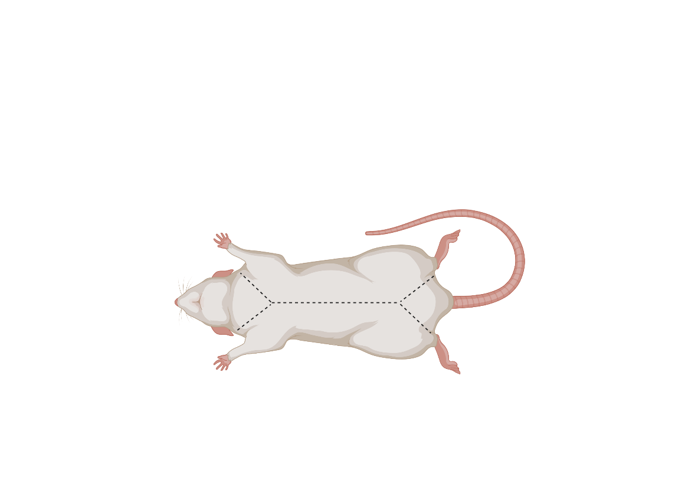

*Figure 6.1: Incisions to open the rat*

Created with BioRender.com.

> 3\. Use pins to hold the skin flaps open to expose the layer of abdominal muscles.
>
> 4\. Once the skin is pinned back, carefully cut through the abdominal muscles to expose the internal organs. Pin back the muscles as needed.

#### **Part Three: Digestive System** 

> 1\. Locate the large, reddish-brown organ called the <u>liver</u> which occupies much of the abdominal space. It is just under the diaphragm. The liver has many functions, one of which is to produce bile which aids in the digestion of fats. The liver also stores glycogen and transforms wastes into less harmful substances. Rats do not have a gallbladder (which is used for bile storing in other animals).
>
> *Note: You may choose to use Figure 6.1 to help identify the organs that make up the digestive system.*

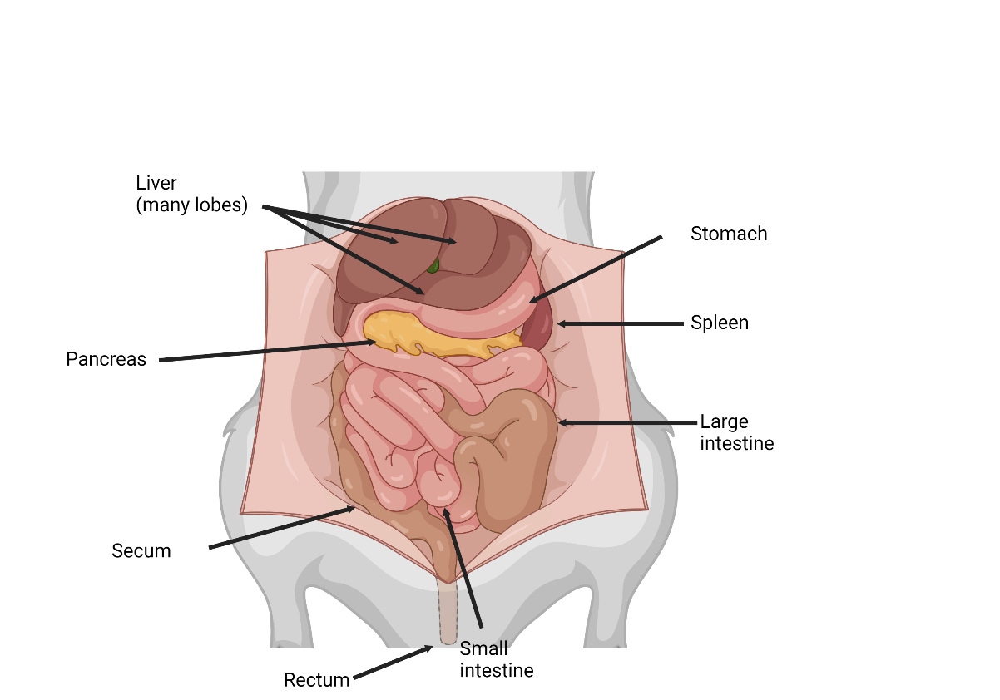

Figure 6.2: Schematic representation of the internal organs of a rat

Created with BioRender.com.

> 2\. Locate the <u>esophagus,</u> which runs through the diaphragm and moves food from the mouth to the stomach. Unlike the trachea, it does not have cartilage rings. This will be best visualized above the liver as it connects to the stomach.
>
> 3\. Locate the <u>stomach</u> on the right side just under the liver. The function of the stomach includes food storage, the physical breakdown of food, and the digestion of protein. The opening between the esophagus and the stomach is called the cardiac sphincter. The outer margin of the curved stomach is called the greater curvature; the inner margin is called the lesser curvature.
>
> 4\. Locate the <u>spleen</u> which is about the same color as the liver and is attached to the greater curvature of the stomach. It is shaped like a banana and is associated with the circulatory system and functions in the destruction of blood cells and blood storage. It helps with the function of the immune system. A person may live without a spleen but are more likely to get sick.
>
> 5\. Locate the <u>pancreas</u> which is a thin membrane that may be white and granular. It lies beneath the stomach. The pancreas produces digestive enzymes that are sent to the intestine via the pancreatic duct.
>
> 6\. Locate the <u>small intestine</u> which is a slender coiled tube that receives partially digested food from the stomach via the pyloric sphincter. The term “small” refers to its diameter, not its length. It consists of three sections: duodenum, ileum, and jejunum. The small intestine leads to the cecum (also spelled caecum, latin term for “blind”). Observe that the small intestine is not loose in the abdominal cavity but is held in place by the mesentery. Check and look for veins and arteries in the clear mesentery; they transport nutrients.
>
> 7\. Locate the <u>cecum</u> which is a pouch that connects the large and small intestine. Food is temporarily stored in the cecum while helpful bacteria digest the cellulose found in plant cells. Most herbivores have a large cecum. In humans and other omnivores, the cecum is smaller and referred to as the appendix.
>
> 8\. Locate the <u>large intestine</u> which is the large, possibly greenish tube that extends from the small intestine and leads to the anus. The final stage of digestion and water absorption occurs in the <u>colon</u> and contains a variety of bacteria to aid in digestion.
>
> 9\. Locate the <u>rectum</u> which is the short, terminal section of the colon between the descending colon and anus. The rectum temporarily stores feces before they are expelled from the body.

#### Part Four: Respiratory System

> The respiratory system is responsible for the exchange of gasses. The rat must take in oxygen for respiration processes and must rid itself of carbon dioxide waste.
>
> 1\. Locate the thin muscular <u>diaphragm</u> just above the liver. This muscle is responsible for drawing air into the chest cavity.
>
> 2\. Holding onto the edge of the rib cage using forceps, cut through the diaphragm to expose the bottom of the lungs. Be careful not to cut too far into the chest cavity.
>
> 3\. Next, cut upwards through the center of the chest cavity, through the middle of the ribcage (the sternum). Cut to the bottom of the rat’s chin.
>
> 4\. Use your fingers to fully open the ribs and expose the cavity.
>
> 5\. Locate the <u>trachea</u>. The trachea is a tube that extends from the neck to the chest. It is white and lined with cartilage rings. The opening of the trachea is the <u>glottis</u>. The enlargement at the anterior end of the trachea is the <u>larynx</u> (voice box) which contains the vocal cords.
>
> 6\. The trachea splits in the chest cavity into two <u>bronchi</u>. Each of these air tubes extends into the lungs and splits into smaller tubes called <u>bronchioles</u>. Using this information, locate the two <u>lungs</u> which lie on either side of the heart.

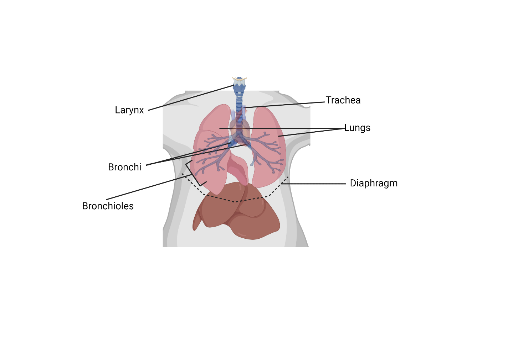

*Figure 6.3: Schematic representation of the respiratory system of a rat*

Created with BioRender.com.

#### Part Five: Circulatory System

> The general structure of the circulatory system of the rat is almost identical to that of humans. Pulmonary circulation carries blood through the lungs for oxygenation and then back to the heart. Systemic circulation moves oxygenated blood through the body after it has left the heart
>
> 1\. Observe the interior of the rat for any veins and arteries. Veins carry used blood (blue) back to the heart and lungs. Arteries carry oxygenated blood (red) to the muscles and organs that need it. The arteries in your rat should be stained red for easy identification. Use Figures 4 and 5 to help you locate the major veins and arteries. (Note: Because of the way the rats have been preserved, the blue color from veins has disappeared and all the vessels are red.)

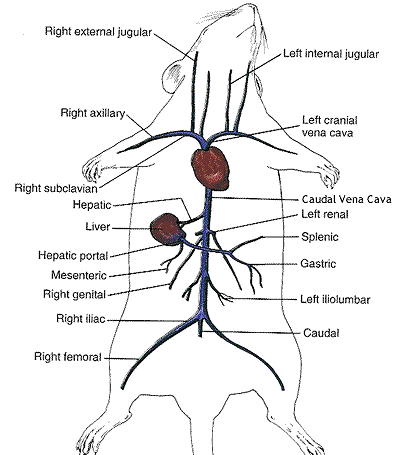

Figure 6.4: The venous system of a rat

Adapted from Rat Dissection Student Version

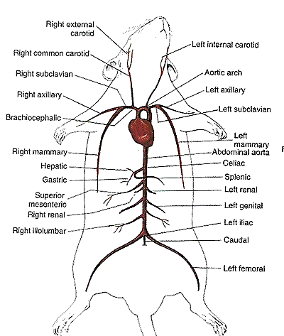

Figure 6.5: The arterial system of a rat

Adapted from Rat Dissection Student Version

> 2\. Locate the <u>heart,</u> which is above the diaphragm and is covered in a thin, tough membrane called the pericardium.
>
> 3\. **Proceed slowly and cautiously** with this next step. Using your forceps and scissors, remove the heart from the pericardial sac and from the chest cavity. You will need to sever the arteries and veins connecting the heart to the circulatory system. Leave as many of the veins and arteries attached to the heart as possible.
>
> 4\. Identify the <u>aorta</u>, the <u>superior vena cava,</u> and the <u>pulmonary artery</u>. If you can’t find them, no worries. These are hard structures to preserve. If the vessels are gone, see if you can identify the openings where they connect with the heart.
>
> 5\. Cut the heart in half through the frontal plane using the sharp blade from your scalpel. The heart is composed of four chambers. Use Figure 6.6 to help you locate the 2 <u>atria</u> and 2 <u>ventricles</u>. You may also notice the septum. It is the structure that separates the two ventricles.

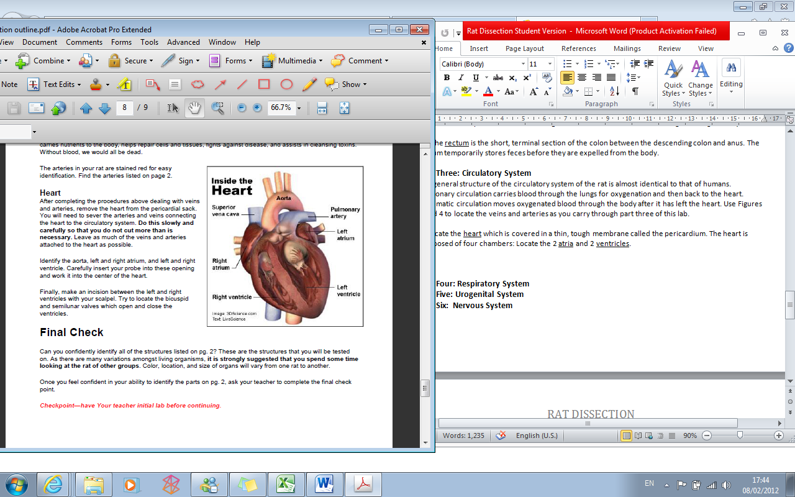

*Figure 6.6: An inside view of the Heart*

Adapted from Rat Dissection Student Version

#### Part Six: Urogenital System 

> This section is a study of the urogenital system. “Uro” stands for the urinary system; “genital” stands for the reproductive system. The urinary/excretory system and genital system are structurally related.
>
> 1\. Locate the <u>kidneys</u> which are the primary organs of the excretory system. These organs are large bean-shaped structures located towards the back of the abdominal cavity on either side of the spine. They will be under the intestines and attached to the back abdominal wall.
>
> 2\. On top of each kidney is a small yellow gland embedded in the fat. This is the <u>adrenal gland.</u> They secrete adrenaline into the blood during times of stress (ie. fight or flight)
>
> 3\. Using your forceps and scissors, remove one of the kidneys and cut it lengthwise. Notice the very fine veins and arteries within. Locate the <u>cortex</u> (outside layer) and <u>medulla</u> (inside section) on one-half of the kidneys.
>
> **4.1: If your rat is male:**
>
> a\) The major reproductive organs of the male rat are the testes (singular: testis) which are located in the <u>scrotal sac</u>. Cut through the sac carefully to reveal the testis. On the surface of the testis is a coiled tube called the <u>epididymis</u> which collects and stores sperm cells. The tubular <u>vas deferens</u> move sperm from the epididymis to the urethra, which carries sperm through the penis and out of the body.
>
> b\) The lumpy brown glands located to the left and right of the urinary bladder are the <u>seminal vesicles</u>. The gland below the bladder is the <u>prostate gland</u> and it is partially wrapped around the penis. The seminal vesicles and the prostate gland secrete materials that form the seminal fluid (semen).
>
> **4.2: If your rat is female:**
>
> a\) The short gray tube lying dorsal to the urinary bladder is the <u>vagina</u>. The vagina divides into two <u>uterine horns</u> that extend toward the kidneys. This duplex uterus is common in some animals and will accommodate multiple embryos (a litter). In contrast, a uterus found in humans has a single chamber for the development of a single embryo.
>
> b\) At the tops of the uterine horns are small lumpy glands called <u>ovaries,</u> which are connected to the uterine horns via <u>oviducts</u>. The oviducts are extremely tiny and may be difficult to find without a dissecting scope.
>
> **  
> \*Note: all students are responsible to know the individual components of both the male and female reproductive systems. Be sure to indicate to students to observe a rat that is the opposite sex of theirs.**

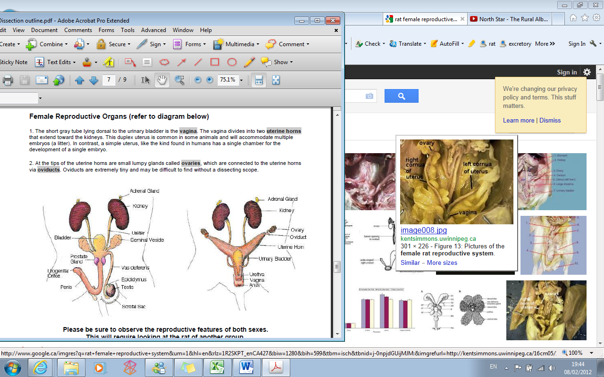

*Figure 6.7: Male rat (left) and female rat (right) urogenital system*

Adapted from [<u>Investigation: Rat Dissection</u>](https://bio.libretexts.org/Learning_Objects/Worksheets/Book%3A_The_Biology_Corner_%28Worksheets%29/Anatomy_Worksheets/Investigation%3A_Rat_Dissection). (2019, June 2). Granite City School District.

#### Part Seven: Nervous System

> This section is a study of the Nervous system. The Nervous system is a complex network of nerve cells that give signals to all organs to help them function properly. The nervous system is comprised of two parts:
>
> A. The Central Nervous System (CNS), and
>
> B. The Peripheral Nervous System (PNS)

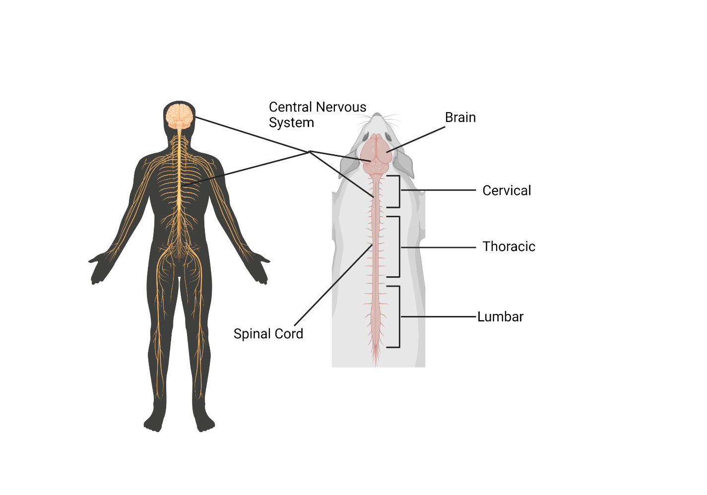

*Figure 6.8: Diagram of a nervous system of a rat*

Created with BioRender.com.

> 1\. The brain is protected by the skull. The brain is the central hub of the nervous system. The brain has several different brain regions which are responsible for generating thoughts and developing memory, developing language, processing visual information from the photoreceptors in the eyes, and many more. The complexity of the brain increases as the organism becomes more complex.
>
> 2\. The central nervous system extends from the brain through the spinal cord. The spinal cord is located within the spine. The spine also acts as a shell to protect the spinal cord from injury. The spinal cord functions to relay messages from the brain to the extremities of the organism. This allows for muscles to contract and relax, the heart and lungs to know when to pump and breathe and coordinate motor movements to name a few. The spinal cord also relays messages from the body to the brain. This allows organisms to understand different sensations, such as when it is too cold or too hot when the skin is damaged like a cut or burn, and to signal the body when to generate internal chemicals like melatonin which is a chemical that helps us fall asleep.

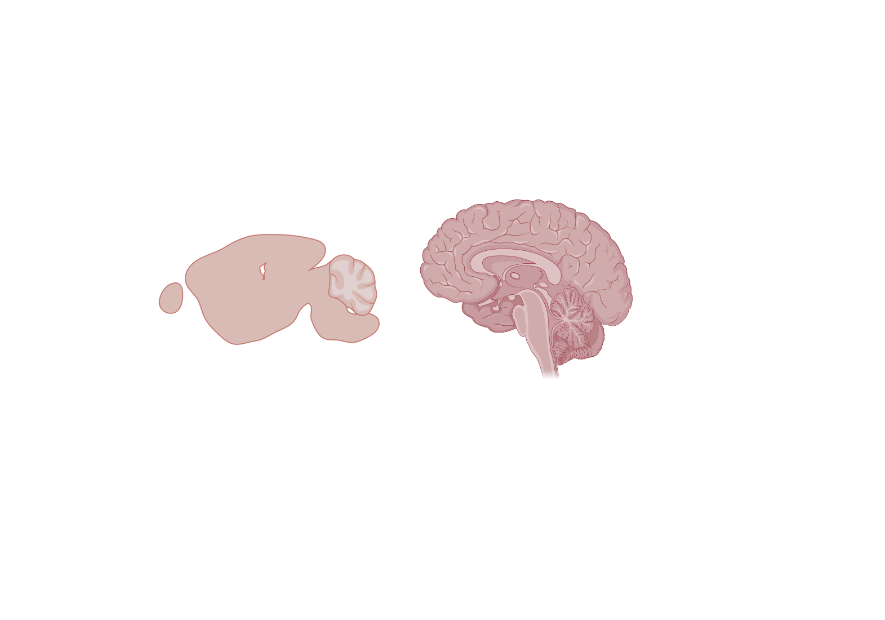

*Figure 6.9: Lateral view of the brain*

Created with BioRender.com.

> **For advanced learners: Dissecting the rat’s brain**
>
> Please follow the protocol described in the [<u>Dissection of Rat Brains</u>](https://cshprotocols.cshlp.org/content/2008/4/pdb.prot4803.full#:~:text=Start%20at%20the%20top%20of,the%20brain%20with%20the%20rongeurs.) website. Please read and adapt steps five through eight.

#### Part Eight: Clean-up

> 1\. With soap or disinfecting towels, wash all the utensils you used except for the scalpel. The instructor will collect all blades at the end of the dissection.
>
> 2\. Wash and thoroughly rinse the dissecting pan.
>
> 3\. Dispose of the rat according to your instructor’s directions.
>
> 4\. Return all materials to their appropriate bin.
>
> 5\. Clear and wipe down your workspace.

#### Part Nine: Final Notes

- You must complete the ticket out the door by the end of this lab.

- You have a lab report to complete for this dissection.

- You must complete a reflection post-dissection.

[<u>Back to TOC.</u>](#table-of-contents)

### Common Checks for Understanding (CFUs) 

#### General CFUs

1.  What organ system it belongs to…?

2.  How does it relate to other components…?

3.  What is its general function?

4.  What is its specific function (if applicable)?

#### Structures of the Head and Neck

1.  What are the four bones in the hindlimb of the rat?

2.  What are the three bones in the forelimb of the rat?

3.  Where does the trachea lead to? The esophagus?

4.  What features do you find in females, but not males?

5.  What tendon connects the gastrocnemius to the calcaneus (Advanced based on body systems)?

6.  What muscle was removed to expose the femur?

7.  What two muscles can be found on the dorsal (back) side of the rat?

8.  What muscle covers the ventral, abdominal region?

9.  What muscle covers the ventral, pectoral region?

10. What structure is responsible for rat vocalization?

#### The Abdominal Organs

1.  Lies under the stomach and secretes insulin.

2.  The section of the large intestine between the ascending and descending colon.

3.  Connects the mouth to the stomach.

4.  Thin membrane that covers the heart.

5.  Muscle that separates the abdominal cavity from the thoracic cavity.

6.  Destroys old blood cells and lies within the folds of the small intestine.

7.  The lobe of the liver has an obvious central cleft.

8.  Another name for the large intestine.

9.  Organs of the respiratory system that lie on either side of the heart.

10. Large organ of the thoracic cavity that lies just under (posterior) to the diaphragm.

11. The last section of the colon, is where the storage of feces occurs.

12. The pouch of the colon is found just where the small intestine joins it.

13. Valve that regulates the passage of food from the stomach to the small intestine.

14. Thin membrane that covers the organs of the abdominal cavity.

15. The first section of the small intestine.

16. The section of the large intestine that is parallel to the diaphragm.

17. Structure related to the immune system, lies at the top of the heart.

18. Valve regulates the passage of materials from the small to the large intestine.

19. The opening in the diaphragm where the esophagus passes through.

20. Section of the small intestine that comes after the duodenum.

#### The Reproductive Organ

1.  What tube connects the kidney to the bladder?

2.  What vessels connect to the kidney?

3.  Urine exits through what external opening on both male and female rats?

4.  Compare the location of the urethral orifice on male and female rats.

5.  What is the function of the excretory system?

6.  Why are the kidneys considered major organs responsible for maintaining homeostasis? (you may need to look this up.)

7.  The word "vasectomy" is derived from the tube known as the vas deferens. What do you think is a vasectomy?

8.  How does the anatomy of a female rat differ from that of a human?

*\*These CFU’s are meant to be used as formative assessment checkpoints throughout the activity.*

[<u>Back to TOC.</u>](#table-of-contents)

### Post-lab Activities

#### Part One: Check for Understanding

These are the structures that you are expected to identify.

Strikethrough each bullet point as you identify the corresponding organ/structure:

**Respiratory System**

- Trachea

- Lungs

- Diaphragm

- Bronchi

**Digestive System**

- Liver

- Esophagus

- Stomach

- Pancreas

- Small Intestine

- Large Intestine

- Rectum

- Spleen

- Cecum

**Circulatory System**

- Heart

- Superior Vena Cava

- Pulmonary Artery

- Aorta/Aortic Arch

- Right/left Atrium

- Right/left Ventricle

**Excretory/Reproductive System**

- Kidneys

- Adrenal Glands

- Ovaries (female only)

- Testes (male only)

#### Part Two: Lab Report

1\. What is the purpose of the lab?

2\. What is the largest organ in the rat’s anatomy? Why?

3\. Why is the gallbladder absent in rats?

4\. Describe in detail the way in which blood travels in the mammalian circulatory system.

5\. Describe three adaptive advantages of the mammalian anatomy.

6\. Describe 3 ways in which the organs of the circulatory system and respiratory system are protected.

7\. Draw a neatly **labeled** diagram of your dissected rat’s internal organs.

- Include the respiratory, circulatory, and digestive systems (do not include the urogenital system).

- The organs you are to include are the ones written on the ticket out the door.

- Marks will be deducted for messy and inaccurate work.

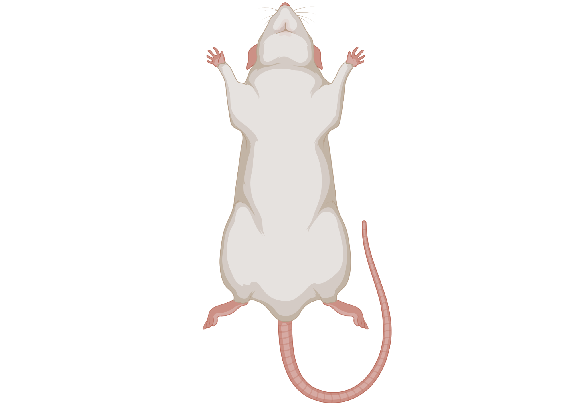

*Figure 6.10: Labeling a dissected rat, biological drawing*

Created with BioRender.com.

#### Part Three: Reflection

**Animal Dissections in Schools**

Overarching Questions:

- Is dissection an ethical activity?

- Is dissection an effective educational practice or are alternatives available that are as effective?

Students and teachers have acknowledged the benefits and disadvantages of dissecting animals for educational purposes. Some believe that it could benefit them educationally, while others feel it does not benefit them and just makes them uncomfortable. Weigh the claims on both sides and then write an argumentative essay, in your own words, supporting either side of the debate in which you argue for or against the dissection of specimens for educational purposes. Be sure to use information from both texts in your argumentative essay.

Before you begin planning and writing, you will read two additional texts. These are the titles of the texts you will read:

- The Advantages of Actual Frog Dissection

- Animals Used in Education

After you read the two passages, you will be given [<u>two writing options</u>](#writing-options-for-students) to choose from. Make sure you complete which ever is more appropriate to demonstrate your perspective towards the main topic, or theme, animal dissections in schools.

##### **The Advantages of Actual Frog Dissection** 

There are many surgeons who say that they first discovered their life’s passion standing over a dissected frog in a middle or high school biology class. But, apart from inspiring the medical professionals of tomorrow, what is the purpose of dissection? And more importantly, why is everyone always dissecting those poor green amphibians? There are many reasons that students in science classes are asked to perform dissections, and they have a lot to do with understanding the body and the wider world. In dissecting an animal, students see, touch, and explore the various organs in the body. Seeing these organs and understanding how they work within a single animal allows students to understand how these systems work within many other animals, including themselves. While there are various aspects that may differ between humans and other animals, many of the organ systems in complex animals work in similar ways to those of humans. Benefits of hands-on dissection include:

**Feeling**

- Though photographs are helpful, a student will not experience the tactile feeling of the frog. In actual dissection, a student must use his or her hands to cut the frog open and pull out the organs. Virtual dissection does not offer this opportunity.

**Future**

- Future doctors, biologists, and other scientists may need at some point to perform surgery or dissections. Practice with actual dissection provides good training for such tasks and a good way for a young person to understand the process. It also gives a student the chance to discover whether he or she possesses an aptitude for this kind of work.

**Lasting Impression**

- Virtual dissection does not create the same lasting impression or vivid memory as actual dissection. Textbooks and Internet images are something students see every day, but an actual once-living thing stays with a person. It has an impact.

**Self-Discovery**

- If a student has moral objections to frog dissection, that can be a good thing and lead to possibilities for self-discovery. No student should be forced to partake in actual dissection if he or she objects to it, but the act of making that decision is also an important part of education.

**Surprises**

- In virtual dissection there are no surprises. Dissection is a good way to learn about the structure of all living creatures, and it's interesting to see how the frog of another student may be different from yours. In virtual dissection, all the frogs are the same. While technology has advanced to the point today where frog dissection can be done virtually, without an actual animal, a student can not see the authentic anatomy of a frog and cannot fully experience it.

Sources:

- [<u>Why Do Students Dissect Frogs? (Mental Floss)</u>](http://mentalfloss.com/article/49855/why-do-students-dissect-frogs)

- [<u>Advantages of Actual Frog Dissection (eHow)</u>](http://www.ehow.com/facts_5718923_advantages-actual-frogdissection.html)

##### Animals Used in Education Classroom Dissection 

The use of animals as dissection specimens in biology classrooms remains a prevalent practice in the United States, with 84% of pre-college biology educators reporting the use of dissection as a teaching tool, according to a nationwide survey of biology educators commissioned by The National Anti-Vivisection Society (NAVS) in 2014. Defined as “the practice of cutting apart or separating tissue for anatomical study,” animal dissection for biology instruction in U.S. classrooms has taken place since the 1920s and became more widely practiced with the establishment of the Biological Sciences Curriculum Study in the 1960s.

As the result of becoming an accepted teaching tool in U.S. schools—from the elementary level through college—for so many years, dissection is considered to be a deeply-rooted tradition in biology education. Many continue to defend the tradition, asserting the importance of a “hands-on” experience and arguing that the exercise excites students about biology and makes a complicated subject “fun.”

Because of that view of dissection, many people never stop to think about where animals used in dissection exercises come from, nor do they consider how many animals are used for this practice. In fact, statistics on the use of animals for dissection are not even maintained in the U.S., so there is no way of truly knowing how many animals’ lives are sacrificed every year. It is estimated that millions of animals of various species are “purpose-bred” or harvested from the wild every year for the sole purpose of being killed for use as dissection specimens.

NAVS’ major objections to dissection include:

**Dissection is academically unnecessary**

> Numerous studies have reported that students who utilize humane dissection alternatives, such as models and computer software, score as well or better on performance tests than students who participate in dissection. No state board of education requires participation in dissection as a condition of graduation, and no college or university stipulates dissection participation as a prerequisite for entrance. A number of countries—including the Netherlands, Switzerland, Argentina, Slovak Republic and Israel—no longer conduct dissection exercises. India also recently banned the dissection of animals in zoology and life sciences university courses, because alternatives can be used to meet the same learning objectives.

**Dissection harms animals**

> While the exact number is unknown, dissection requires the killing of an estimated 12 million animals annually in the U.S. alone. Some students and educators do not have issues with dissection if they are using “ethically sourced” animals, such as cats euthanized from animal shelters or fetal pigs that are byproducts of the food industry. However, it should be noted that frogs—the most commonly used animals for dissection exercises—are harvested and killed specifically for biological study. Fish and sharks are also captured from the wild by fishermen who sell their dead bodies to biological supply companies to make a profit. Given efforts in other areas to implement the 3Rs principle of Russell and Birch to reduce, refine and replace the use of animals whenever possible, much more can be done to replace the use of animals in education without sacrificing student knowledge. With the widespread availability of dissection alternatives, there is no need to continue to harm animals for the purpose of animal dissection.

**Dissection is hazardous to the environment**

> The collection of animals for dissection exercises has negative consequences on the environment. India banned dissection at the university level “to prevent the disruption of biodiversity” and to maintain “ecological balance.” The collection of frogs to be used as dissection specimens has depleted many local populations, leading some areas—including Michigan, Wisconsin, and all of Canada—to outlaw their commercial harvesting.

**Dissection can be hazardous to students**

> Chemicals used to preserve biological specimens, even non-toxic formaldehyde substitutes, have been reported to cause headaches, drowsiness, and eye, nose, and throat irritation in students performing dissection exercises. Also, dissection requires the use of sharp cutting tools, such as scalpels, which pose safety risks to students.

**Dissection instills a view that animal life is expendable**

> Educators who insist on using animal specimens rather than non-animal alternatives as teaching tools miss a valuable opportunity to teach their students about humane education and are not implementing the 3Rs principle of reduction, refinement, and replacement of animal use. The use of an animal specimen when alternatives that can achieve the same learning objectives are widely available teaches students that animals’ lives are disposable and have little importance.

**Dissection is economically wasteful**

> Non-animal alternatives are far more economical than the use of dissection specimens in the long run because they can be used repeatedly and indefinitely with no need to constantly replenish (and pay for) supplies of once-live animals. With the availability of innovative dissection alternatives, more can be done by the educational community to replace the use of animals in dissection exercises. Greater support of alternatives by teacher organizations, along with more widespread dissemination of information about alternatives and student choice policies, would better inform students and teachers about this important issue. Providing comprehensive information to educators about studies that have examined student learning with alternatives versus dissection, the cost of alternatives and where they can be borrowed or purchased, and curriculum guides that incorporate alternatives may change educators’ perceptions about alternatives and encourage their use. Simple changes to current policies, such as asking students to “opt-in” to dissection rather than to “opt-out,” or merely informing students of the availability of alternatives, may have a significant impact on the number of animals used in education. Additionally, more should be done to introduce legislation that mandates student choice in states that currently lack such policies.

Source: [<u>Science Corner (National Anti-Vivisection Society)</u>](http://www.navs.org/what-we-do/keep-you-informed/sciencecorner/areas-of-science-that-use-animals/animals-in-education/)

##### Writing Options for Students

**Writing Task 1: *Write a Constructed Response***

> Which author most successfully develops the topic according to their purpose using reasoning and evidence? Use details from both passages to support your answer.

**Writing Task 2: *Write an Argumentative Essay***

> Now that you have read ”The Advantages of Actual Frog Dissection” and “Animals Used in Education,” create a plan for your argumentative essay. Weigh the claims on both sides. Think about ideas, facts, definitions, details, and other information and examples you want to use. Think about how you will introduce your topic and what the main topic will be for each paragraph. Develop your ideas clearly and use your own words, except when quoting directly from the source texts. Be sure to identify the sources by title or number when using details or facts directly from the sources.
>
> Weigh the claims on both sides and then write an argumentative essay, in your own words, supporting either side of the debate in which you argue for or against frog dissection in schools. Be sure to use information from both texts in your argumentative essay. Now write your argumentative essay.
>
> Be sure to:

- Introduce your claim.

- Support your claim with logical reasoning and relevant evidence from the texts.

- Acknowledge and address alternate or opposing claims.

- Organize the reasons and evidence logically.

- Use words, phrases, and clauses to connect your ideas and to clarify the relationships among claims, counterclaims, reasons, and evidence.

- Establish and maintain a formal style.

- Provide a concluding statement or section that follows from and supports the argument presented.

- Check your work for correct grammar, usage, capitalization, spelling, and punctuation.

*\*You can guide students through the writing process by using the [<u>CERR</u>](https://drive.google.com/file/d/1naiTYsloASeOEmEbLyNg0wbGxaNPkNeB/view?usp=sharing) process.*

[<u>Back to TOC.</u>](#table-of-contents)

## Social Impact

**Lung Cancer: Understanding the Risks of Smoking (Vaping)**

Smoking increases the risk of various cancers because tobacco smoke contains harmful chemicals, many of which can cause cancer. Here is how you can connect the dissection activity to the risks of smoking and the correlation with lung cancer:

1.  [<u>Lung damage</u>](https://www.mdanderson.org/cancerwise/what-happens-to-your-lungs-from-smoking--3-things-to-know.h00-159540534.html): Inhaling smoke harms the respiratory system, causing inflammation and damage to lung cells over time, leading to lung cancer.

2.  [<u>DNA damage</u>](https://www.nbcnews.com/health/health-news/smoking-permanently-scars-your-dna-study-finds-n651471): Chemicals in tobacco smoke can directly damage cell DNA, causing mutations that disrupt normal cell growth and lead to tumor formation.

3.  [<u>Carcinogen exposure</u>](https://www.cancer.org/cancer/risk-prevention/tobacco/carcinogens-found-in-tobacco-products.html#:~:text=Tobacco%20smoke%20is%20made%20up,that%20people%20are%20looking%20for)): Tobacco smoke contains well-known cancer-causing chemicals that can initiate and promote cancer development by causing genetic mutations and interfering with cellular processes.

4.  [<u>Weakened immune function</u>](https://www.cdc.gov/tobacco/sgr/50th-anniversary/pdfs/fs_smoking_overall_health_508.pdf): Smoking weakens the immune system's ability to recognize and eliminate cancer cells, allowing them to grow and increase the risk of cancer.

5.  [<u>Secondhand smoke</u>](https://www.cancer.org/cancer/risk-prevention/tobacco/health-risks-of-tobacco/secondhand-smoke.html): Non-smokers exposed to secondhand smoke also face an increased cancer risk due to the harmful chemicals present, similar to direct smoking.

It is noteworthy that smoking raises the risk not only of lung cancer but also other cancers in the body. Quitting smoking is the best way to lower the risk of cancer and improve overall health.

**Investigative Questions - Writing Prompts**

1.  What is the effect of tobacco use on the various organs in the human body?

2.  What diseases affect smokers?

3.  How do the organs appear after they have been affected by tobacco use?

4.  What long and short-term health risks does tobacco use cause?

**Graphic Organizers**

1.  [<u>CDC Graphic Organizers</u>](https://drive.google.com/file/d/1SPc5zd36Zp2EddgQ_Zxk1gUzf93cVjAV/view?usp=sharing)

**Resources:**

The following sites will provide data and statistics on youth tobacco use, science-based strategies to reduce it, and information on DASH-supported programs, publications, and links.

- Smoker’s Lungs: [<u>video courtesy of MD Anderson</u>](https://www.youtube.com/watch?v=uirINayrSJs).

- Centers for Disease Control and Prevention (CDC): [<u>www.cdc.gov</u>](http://www.cdc.gov)

- Tobacco Information and Prevention Source (TIPS): [<u>CDC: Smoking & Tobacco Use</u>](http://www.cdc.gov/tobacco/index.htm)

- CDC Division of Adolescent and School Health (DASH) Tobacco Use: [<u>CDC Healthy Youth: Tobacco Use</u>](http://www.cdc.gov/HealthyYouth/tobacco/index.htm)

<!-- -->

- CDC BAM! Body and Mind: BAM! [<u>CDC BAM! Classroom Resources for Teachers</u>](https://www.cdc.gov/healthyschools/bam/teachers.htm)

> Body and Mind is a site created by the Centers for Disease Control and Prevention (CDC), an agency of the U.S. Department of Health and Human Services (DHHS). BAM! was created to answer kids' questions on health issues and recommend ways to make their bodies and minds healthier, stronger, and safer. BAM! also serves as an aid to teachers, providing them with interactive activities to support their health and science curriculums that are educational and fun.

- American Lung Association: [<u>American Lung Association</u>](http://www.lung.org/)

- Adolescent Smoking Statistics: [<u>American Lung Association: Tobacco Trend Reports</u>](http://www.lung.org/finding-cures/our-research/trend-reports/Tobacco-Trend-Report.pdf)

> This is a fact sheet that includes current research information on adolescents and smoking.

- Campaign for Tobacco-Free Kids: [<u>Campaign for Tobacco-Free Kids</u>](http://www.tobaccofreekids.org/)

> The Campaign for Tobacco-Free Kids is one of the nation's largest nongovernmental initiatives. ever launched to protect children from tobacco addiction and exposure to secondhand smoke. The site includes current information about state legislation designed to deter teen smoking.

- National Institute on Drug Abuse (NIDA): [<u>National Institute on Drug Abuse</u>](http://www.drugabuse.gov/)

- NIDA for Teens: [<u>NIDA: Students & Young Adults</u>](http://www.drugabuse.gov/students-young-adults)

> This Web site presents scientific information about drug abuse in a way that is easy for teens to understand and use. In addition to nicotine, the site also features information on marijuana, inhalants, opiates, hallucinogens, methamphetamines, stimulants, and steroids.

[<u>Back to TOC.</u>](#table-of-contents)

## Mathematics Extension

**Measurements**

**Instructions:**

> As students perform the dissection, have them collect measurements of the specimen, specifically the rodent’s digestive system and height, to establish a relationship between humans and rats –proportions. This concept is usually taught in sixth-grade math, and students will come with a basic understanding of ratios from elementary school. The different components of the rat will be laid out on a paper towel, and students will use Sharpies or pens to mark the dimensions, then will use a measuring ruler to calculate the distance between the two points. Ask students to clean up the plastic rulers after they complete the dissection.
>
> **Graphic Organizer:**

| **Group / Table** | **Length of Rat (Note to Tail)** | **Length of Small Intestine** | **Length of Large Intestine** | **Length of Entire Digestive Tract** |
|-------------------|----------------------------------|-------------------------------|-------------------------------|--------------------------------------|
|                   |                                  |                               |                               |                                      |
|                   |                                  |                               |                               |                                      |
|                   |                                  |                               |                               |                                      |
|                   |                                  |                               |                               |                                      |
|                   |                                  |                               |                               |                                      |
|                   |                                  |                               |                               |                                      |
|                   |                                  |                               |                               |                                      |
|                   |                                  |                               |                               |                                      |
|                   |                                  |                               |                               |                                      |
|                   |                                  |                               |                               |                                      |
| **Averages**      |                                  |                               |                               |                                      |

> *Figure 7.0: Average Lengths of a Rat’s Digestive Tract.*
>
> **Average Human Height:**

- Female: 159 cm or 1.59 m

- Male: 171 cm or 1.71 m

**Average Length of Human Digestive System:**

- For both females and males: 900 cm or 9.00 m

**Calculating Averages:**

- $Average\  = (The\ sum\ of\ values)\  \div (The\ number\ of\ instances)$

**Calculating Ratios:** Height v. Digestive Track Length

- Use the following formula for both the rat and humans:

- $Average\ Length\ of\ Digestive\ Tract\  \div Average\ Length\ of\ the\ Body\ $

[<u>Back to TOC.</u>](#table-of-contents)

## Interdisciplinary Approach

The action plan can be implemented from a holistic approach through many subjects. Encourage your entire grade level team or fellow teachers for your cohort of students to be involved in the experience, as it creates a long-lasting memory in students’ lives.

> **Interdisciplinary Ways of Thinking**
>
> - **Evaluate:** Inquiry
> - **Synthesize:** Action
> - **Reflect:** Reflection

*Figure 8.0: Interdisciplinary Approach to Teaching.*

Adapted from the IB/MYP Interdisciplinary Learning Guide.

1.  **Social Studies:** [<u>Ethics and Implications</u>](#ethics-animal-dissection---a-contested-school-science-activity).

2.  **English Language Arts:** [<u>Pro and Cons of Dissections</u>](#part-three-reflection).

3.  **Reading:** [<u>Comfort Level with Dissections & Benefits and Drawbacks of Dissections</u>](#comfort-survey-the-dissection-of-a-laboratory-rat).

4.  **Physical Education:** [<u>Homologous and Analogous Structures</u>](#homologous-and-analogous-structures) & [<u>Understanding Rat Behavior</u>](#background-knowledge).

5.  **Mathematics:** [<u>Ratios Between Humans and Rats</u>](#mathematics-extension).

6.  **Science:** [<u>Safety, Pre-Lab, Dissection and Post-Lab</u>](#rodent-dissection-manual).

7.  **Art:** [<u>Diagrams & Labeling the Rat’s Structures</u>](#part-two-lab-report).

8.  **Technology:** [<u>Social Impact</u>](#social-impact) & [<u>Further Directions</u>](#further-directions).

9.  **Foreign Languages (Spanish):**

    1.  Shared experiences after the dissection in the target language, and have students use the newly acquired vocabulary in Spanish, and since most scientific terms derive from Latin and Greek, they, more likely, are true cognates in Spanish.

[<u>Back to TOC.</u>](#table-of-contents)

## Further Directions

Students can research CRISPR since it is how scientists model cancer in the laboratory: CRISPR allows scientists to create precise genetic modifications in cells and animal models, mimicking cancer-related mutations observed in human patients. Additionally, this has enabled researchers to study the effects of specific genetic alterations on cancer development, progression, and response to treatments. By creating more accurate animal models, CRISPR aids in advancing the understanding of cancer biology and developing targeted therapies. Last, learning about CRISPR is important because it can transform fields like medicine, agriculture, and biotechnology.

**Possible Areas of Research:**

- [<u>Medical Advancements:</u>](https://www.cancer.gov/news-events/cancer-currents-blog/2020/crispr-cancer-research-treatment) CRISPR can treat genetic disorders by targeting specific genes and making precise modifications. It may correct mutations responsible for cystic fibrosis, sickle cell anemia, and cancer. Learning about CRISPR keeps you informed about medical research and potential treatments.

- [<u>Ethical Considerations:</u>](https://www.npr.org/sections/health-shots/2023/03/06/1158705095/genome-summit-gene-editing-ethics-crspr) CRISPR raises important ethical questions regarding modifying human embryos, altering germline genetic material, and creating GMOs. Learning about CRISPR helps you participate in ethical discussions and make informed decisions.

- [<u>Agriculture and Environment:</u>](https://www.genengnews.com/topics/genome-editing/from-pharma-to-farm-can-crispr-feed-the-world/) CRISPR can revolutionize agriculture by creating crops resistant to pests, diseases, and harsh conditions. It can also enhance nutritional content and reduce pesticide use. Understanding CRISPR's impact on agriculture enables informed decisions about food production and the benefits and risks of genetically modified crops.

- [<u>Technological Literacy:</u>](https://www.nytimes.com/2022/06/27/science/crispr-gene-editing-10-years.html) CRISPR relies on complex biology and genetic engineering. Learning about CRISPR enhances scientific literacy and understanding of biological concepts, fostering an appreciation for biotech advancements and their implications.

- [<u>Empowerment and Engagement:</u>](https://geneticliteracyproject.org/2018/07/10/who-will-crispr-benefit-how-to-prevent-this-life-saving-technology-from-creating-gender-and-geographical-disparities/) Learning about CRISPR empowers you to engage with scientific advancements. It helps you make informed decisions about your health, understand genetic therapies' risks and benefits, and participate in policy, regulation, and ethics discussions.

- Career Opportunities: CRISPR creates research and development opportunities in [<u>molecular biology</u>](https://www.environmentalscience.org/career/molecular-biologist#:~:text=Molecular%20Biologists%20require%20a%20Ph,to%20advance%20without%20further%20education.), [<u>genetics</u>](https://www.acmg.net/ACMG/Education/Student/Careers_in_Medical_Genetics.aspx#:~:text=Clinical%20geneticists%20have%20medical%20degrees,genetics%20and%20genomics%20residency%20training.), [<u>medicine</u>](https://www.usnews.com/education/best-graduate-schools/top-medical-schools/articles/how-to-become-a-doctor-a-step-by-step-guide), [<u>biomedical engineer</u>](https://www.healthcaredegree.com/lab/biomedical-engineer) and [<u>biotechnology</u>](https://www.healthcaredegree.com/lab/biotechnologist). Learning about CRISPR opens doors to careers in these emerging fields.

Learning about CRISPR is crucial as it can revolutionize medicine, agriculture, and biotechnology. It keeps you informed, enables ethical discussions, helps you make informed decisions, and engages you with significant scientific advancements.

[<u>Back to TOC.</u>](#table-of-contents)

## References

Domínguez-Oliva A, Hernández-Ávalos I, Martínez-Burnes J, Olmos-Hernández A, Verduzco-Mendoza A, Mota-Rojas D. The Importance of Animal Models in Biomedical Research: Current Insights and Applications. Animals (Basel). 2023 Mar 31;13(7):1223. doi: 10.3390/ani13071223. PMID: 37048478; PMCID: PMC10093480.

Investigation: Rat Dissection. Granite City School District, 2 June 2019, [<u>Biology LibreTexts (page 20726)</u>](https://bio.libretexts.org/@go/page/20726).

Meek S, Mashimo T, Burdon T. From engineering to editing the rat genome. Mamm Genome. 2017 Aug;28(7-8):302-314. doi: 10.1007/s00335-017-9705-8. Epub 2017 Jul 27. PMID: 28752194; PMCID: PMC5569148.

Rat Dissection Student Version, [<u>Eagle Mountain-Saginaw Independent School District</u>](https://www.emsisd.com/cms/lib/TX21000533/Centricity/Domain/4325/Rat%20Dissection%20Student%20Version.docx), 2012.

*\*Additional sources were used to construct this multi-day and interdisciplinary activity. They are listed throughout the document. Make sure you cite them when reproducing the copies for your classroom. All BioRender graphs can be reproduced under the [<u>license terms</u>](https://help.biorender.com/en/articles/5256792-biorender-publication-guide).*

[<u>Back to TOC.</u>](#table-of-contents)
